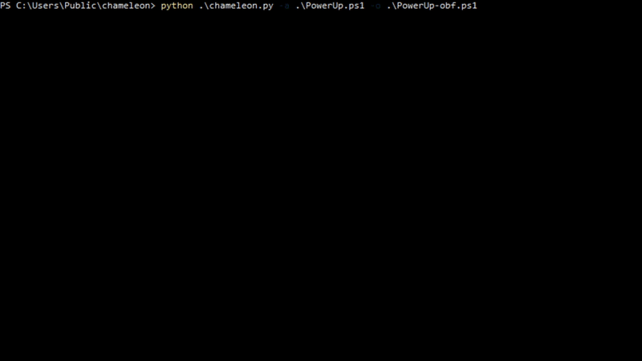

# Chameleon: Born from a Chimera

## TL;DR

This post is a brief description of the work recently conducted on a known PowerShell obfuscator named 
[Chimera][1] by [tokioneon_][2], which resulted in the creation of the illegitimate son of [Chimera][1]:

* [Chameleon](https://github.com/klezVirus/chameleon.git)

## Introduction

In software development, obfuscation is a technique used by developers to deliberately create source-code (or machine code)
in a way that is difficult for humans to understand. The art of obfuscating code has many use cases in the IT industry: 

* tamper protection
* reverse engineering deterrent
* fun (!?)

In the cybersecurity space, and specifically in the context of this article, the main goal of the obfuscation process
will be to hide malicious code and bypass common defensive mechanisms, like AMSI and commercial AV products.

Types of obfuscations include simple keyword substitution, encoding change, and compression.

Regarding PowerShell, common obfuscation techniques may include:

1. naming obfuscation (variables, function, and data-types)
2. data/code/comment confusion
3. double coding

## Previous work

Various studies can be found in literature about this topic and previous tools have been presented, as example:

* [Invoke-Obfuscation][8]: amazing obfuscator by Daniel Bohannon 
  ([@Cobbr][7], CovenantC2 creator, is an official maintainer as well), it implements 
  quite an impressive number of obfuscation techniques. It's written in PowerShell.
* [Chimera][1]: a little obfuscator by [@tokioneon_][6]. It's not as powerful as the previous one, but does its job pretty well.
It's written in bash.

Invoke-Obfuscation is certainly the standard de-facto tool for PowerShell obfuscation, and is far more complex than the 
Chimera project. However, with Chimera, [tokioneon_][2] clearly showed that using a slightly simpler approach could give 
very good results as well.

## Our work on the topic

For the scope of a side-project of mine, I needed to develop something that I could integrate with a bigger Python 
framework. I wanted something quick and simple, yet reliable. Playing a bit with Invoke-Obfuscation, I soon realised that
the tool (as it is) couldn't allow me the customization I needed, so I decided to study the inner work of Chimera a 
bit more.

### The insides of the creature

Chimera operates mostly by using a set of simple techniques, to ensure deletion of AV signatures within the obfuscated 
payload. The set of techniques can be summarised as:

* string 'split-n-merge': any string identified as a "red flag" will be split it in tokens, then reassembled (including data-types)
* variables/function substitution: any variable or function name will be substituted with a random string
* comment confusion: all comments will be substituted with random strings
* (partial) random case: to any string provided by the user, the case (lower/upper) will be randomized
* (partial) backticks insertion: any string generated by the tool will also be randomly backticked

### The creature is suffering

However, comparing it to Invoke-Obfuscation, we found that many Chimera functions were lacking reliability 
(breaking more complex scripts). Moreover, Chimera was also not implementing very simple tricks which could have made 
better or just a bit more reliable, such as: 

* Command tokens reconstruction

PowerShell allows executing commands (or their aliases) from strings, using the '&' character:

```powershell
$token1 = "i"
$token2 = "e"
$token3 = "x"
$final = &($token1 + $token2 + $token3) # This will execute iex
```

* Function names cases can be randomized, and allow backticks insertion

```powershell
# This function
function Invoke-VeryLongFunctionName { ... }

# Can be written as
function InV`o`kE-VEr`Y`L`oN`GfUn`Ct`i`oNna`Me { ... }
```

* It's not possible to replace data-types globally in a safe manner (as they were just "strings"):

```powershell
# Changing Net.WebClient is safe here
# $wc = New-Object Net.WebClient

$RandomVariable = "Net.WebClient"
$obj = New-Object $RandomVariable
# ------------------------------------------------------------------------
# But not safe here
# $content = [System.Net.WebClient]::DownloadString("http://example.com")

$RandomVariable = "Net.WebClient"
[System.$RandomVariable]::DownloadString("http://example.com") # ERROR!!!
```

* The IP address pattern is way too broad:

```shell
# The pattern includes values out of range
# \d{1,3}\.\d{1,3}\.\d{1,3}\.\d{1,3}

echo "999.999.999.999" | 
sed 's/\d{1,3}\.\d{1,3}\.\d{1,3}\.\d{1,3}/:3/g' # Returns :3 

# The best pattern so far is a bit longer, but stricter 
# (?:(?:25[0-5]|2[0-4][0-9]|1[0-9][0-9]|[1-9][0-9]|[0-9])\.){3}(?:25[0-5]|2[0-4][0-9]|1[0-9][0-9]|[1-9][0-9]|[0-9])

echo "999.999.999.999" | 
sed 's/(?:(?:25[0-5]|2[0-4][0-9]|1[0-9][0-9]|[1-9][0-9]|[0-9])\.){3}(?:25[0-5]|2[0-4][0-9]|1[0-9][0-9]|[1-9][0-9]|[0-9])/:3/g' # Returns 999.999.999.999
```

* It's not a good idea to randomise function parameter names, as they are keyed-values

```powershell
# Given the following function
function Invoke-Function{
    param(
        [String]
        $Name,
        [String]
        $Args
    )
}

# The function can be called with
Invoke-Function -Name $v1 -Args $v2
#----------------------------------------------------------------------
# If the function is changed like the following
function Invoke-Function{
    param(
        [String]
        $abcdefghilmnopqrstuvz,
        [String]
        $aaaaabbbbbcccccddddd
    )
}

# The function would need to be called with the same names as keys
Invoke-Function -abcdefghilmnopqrstuvz $v1 -aaaaabbbbbcccccddddd $v2
```

#### Other minor issues

Moreover, there were a bunch of other minor issues which needed to be addressed, such as:

* Each obfuscation step performed a full file r/w operation from/to the HDD
* The AV Evasion test was implemented using Virus Total (really not recommended)

### A creature born from a Chimera

To fix the issues shown by Chimera, it was decided to reimplement the tool using another scripting language, more
specifically, Python.

At the beginning, the techniques used by Chameleon were mostly the same as Chimera, with some improvements to solve the 
issues outlined above, such as:

* "Smart" variable scope identification (function local variables will be replaced "carefully" or left untouched)
  * The tool can identify function scoped variables and parameters, and obfuscate accordingly
  * Details below
* Random backticks insertion (not just limited to a set of strings)
  * Function names
  * Variables
  * Strings generated by the program itself
* Random case switch (not just limited to a set of strings)
  * Function names
  * Variables
  * "Safe" data types (All data types not appearing within square brackets "[.*]")
* Supports an external obfuscation mapping for functions ~~and parameters~~ (TODO)
  * The tool allows mapping function names within the script with arbitrary function names provided externally
  * Details below (PSmapper and Translate utilities)
* Additional Base64 Encoding wrapping
  * Wraps the whole script within an `IEX` call, using base64 encoding

However, something is still missing that would be cool to include:
  * TODO: Improve identification of string tokens (".*", '.*') for backticks insertion (and more)
  * TODO: Improve identification of command tokens (`IEX`, `ICM`, etc.) for command reconstruction (and more)

#### Could Chameleon read PS?

Chameleon manages to handle functions and local parameters by implementing a very minimalist PowerShell "reader", which 
is, by now, capable of distinguish only three contexts: 

* Global/Main context
* Function/Filter definition context (Nested included)
    * Param() Block context 

As easily guessable, the reader is not even near a real parser, and relies on Dick Language only to find the limits 
(start and end) of relevant code blocks. The reader works basing on the following, not necessarily true, assumptions:

1. Let p be a pretty-printed PowerShell script, and let be s a step reached by single-line reading, s can be in three 
   different code contexts (or blocks) types:
   * Main block of the program
   * Function/Filter definition block
   * Class definition block

2. In common PowerShell scripts for Red Teaming, user defined classes are not really used so much, so they can be ignored.
   (Whether they are, it would be necessary to study how renaming variables within the class would impact the caller block)

Given the above, the only things really important to identify are the following:

* Functions and filters definition block
* Parameters declaration block

Removed all comments, identify where functions start is trivial, and can be done simply reading the file line-by-line, 
detecting any pattern like `function\s([\w\-]*)\{?`. When a line like that is encountered, the reader can safely assume
a function block is starting. From that moment on, the tool need to see if the Dick language of ["{", "}"] will reach a 
"balanced" state [#"{" == #"}"]. 

The very same approach can be used to identify parameter blocks, with two little differences:
1. The Dick language for parameter blocks would be defined in the alphabet ["(", ")"]
2. A parameter block can be opened only if `s` is within a function context

However, that is far from being enough. Indeed, the tool needs to keep a stack of calls to handle nested function calls
and parameter blocks. 

##### Known issues

However, this process is actually susceptible to errors, if in a function context is present a string with unbalanced 
curly brackets, as shown below:

```powershell
function Invoke-BreakChameleon{
    params(
        ...
    )
    $safe_local_var = "{{{ SAFE }}}" # This string contains balanced curly brackets, SAFE!
    ...
    $local_var = "}}}" # ERROR: This string will break the reader!
    ...
}
```

Even if this kind of situation doesn't really appear normally, this is far from being ideal. The issue is even more 
important considering that currently Chameleon cannot properly detect all string tokens within the PowerShell scripts,
hence it cannot ensure to fix this issue even replacing the dangerous content.

More work will be done soon to improve the reader capabilities, till making it (maybe) a real PowerShell parser.

### Additional tools

Chameleon, in addition to its obfuscation capabilities, also offers two tools: PSMapper and PSTranslate.

The ability to Chameleon to support externally provided mappings, forced the author to produce a tool which could be used 
to actually generate this mapping files. This tool is called PSMapper (psmapper.py).

Using the tool on the PowerShell script you want to obfuscate, PSMapper will generate a mapping using a name scrambling
technique. This technique is different and way more readable than random string substitution.

```
usage: psmapper.py [-h] -o OUTFILE target

Chameleon PSMapper - Helper to create obfuscated function mappings

positional arguments:
  target                Target PS1 script

optional arguments:
  -h, --help            show this help message and exit
  -o OUTFILE, --outfile OUTFILE
                        Output file
```

Once done, it is possible to apply the specified mapping using the `-F` flag.

Regardless the use of the -F flag, while obfuscating Chameleon will still produce a function mapping file, named 
`function_mapping.json`. As after a full obfuscation the function names will become pretty unreadable, the user can 
still identify their obfuscated name using this utility.

```
usage: pstranslate.py [-h] -f FUNCTION mapping

Chameleon PSTranslate - Helper to search obfuscated functions

positional arguments:
  mapping               Mapping file

optional arguments:
  -h, --help            show this help message and exit
  -f FUNCTION, --function FUNCTION
                        Function to search
```

A sample usage is provided in the image, below:



### Speed and AV Evasion testing

With regard to speed, Chameleon is extremely fast. Obfuscating a complex script with Chimera can take up to several minutes, 
with Chameleon is matter of seconds. In the GIF below, the tool is obfuscating and using PowerUp:


Talking about AV evasion testing, Chameleon comes with [AMSITrigger][4] by [RhytmStick][5], to check if the obfuscated script
will indeed bypass AMSI, hence completely removing the VirusTotal uploading.

In the image below, the test was invoked automatically using the `-z` flag:

```
python .\chameleon.py -a .\PowerUp.ps1 -o .\PowerUp-obf.ps1 -z
```


## Conclusions

From 2016, Invoke-Obfuscation has been the tool of choice for PowerShell obfuscation, and it remains so even after 5 years.
One of the reasons for that is that both PowerShell and C#, leveraging System.Management.Automation.Parser and similar classes,
have almost full understanding of data-types, variables, and context of any PowerShell scripts, and can operate accordingly. 

Anyway, tools like [Chimera][1] showed that using slightly different approaches can also lead to success, even if not without 
a bit of effort and pain. I truly hope this project would encourage someone to leverage what has been developed so far to 
produce something even better... as the Chimera project did with me.

## Credits

Worth saying that Chameleon would not be a thing without the work of [tokioneon_][2] on [Chimera][1], as good part of the
obfuscation process was ported from Bash to Python.

## References

* [Chimera][1]
* [Invoke-Obfuscation][8]
* [AMSITrigger][4] 

[Back to Red Teaming](../../)

[Back to Home](https://klezvirus.github.io/)

[1]: https://github.com/tokyoneon/Chimera.git
[2]: https://twitter.com/tokyoneon_
[3]: https://github.com/tokyoneon/Chimera/tree/master/shells
[4]: https://github.com/RythmStick/AMSITrigger
[5]: https://github.com/RythmStick
[6]: https://twitter.com/tokyoneon_
[7]: https://twitter.com/cobbr_io 
[8]: https://github.com/danielbohannon/Invoke-Obfuscation