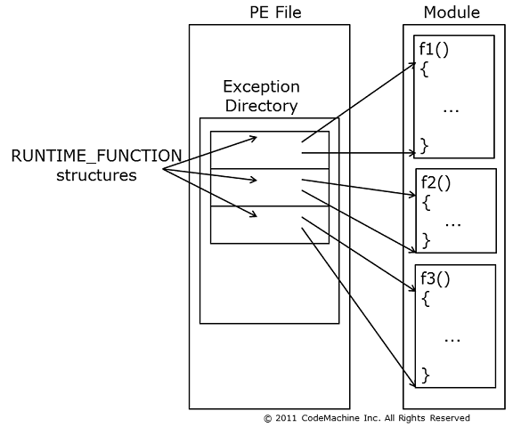

# SilentMoonwalk: Implementing a dynamic Call Stack Spoofer

## TL;DR

With the evolution of cyber defence products, we've seen in the Red Teaming and Malware Development 
community a rise in advanced memory evasion techniques, which aim to bypass the detection of
malicious code by concealing their presence while they reside in the memory of a target process.

Among these techniques, we can find the so-called "Stack Spoofing", which is a technique that
allows to hide the presence of a malicious call in the stack, by replacing arbitrary stack
frames with fake ones.

In this article, we'll present a PoC to implementation of a true dynamic stack spoofer, which will allow us not
only to spoof the call stack to our call, but also to hide the real origin of the call, not only during sleep,
but also during the program execution.

## Overview

The research covered in this article is joint research of **Arash Parsa**, aka [waldo-irc][2],
**Athanasios Tserpelis**, aka [trickster0][3], and me (**Alessandro Magnosi**, aka [klezVirus][1]).

The research was based on the work of [namazso][4], who has designed 
the original idea behind this technique.

## Introduction

In-depth memory analysis and call stack analysis techniques are technique which have long
been used by Anti-Cheat engines to detect malicious code in memory. Of course, these techniques
are not limited to Anti-Cheat engines, and are slowly being adopted by other security product 
to detect malicious code.

Focusing on the call stack, it's trivial to understand why its analysis can provide anti-cheat engines and EDR products 
with crucial source of telemetry. 
The call stack indeed can provide a security solution with important contextual information regarding 
a function call, including:

* The module that called the current function (i.e., the "original" caller)
* The exact "path" that the call took to reach the current function (i.e., the "call stack", which is tautological)

In this context, we've already seen security products using call stack analysis to detect 
code executed from unbacked memory regions (i.e., not associated with a file on disk), or to enrich 
behavioural analysis by correlating the call stack with the behaviour of the process
(e.g., mapping what module is opening a handle to LSASS).

Even more, the call stack analysis is what security products can use in Userland to detect
indirect system calls made by a process. In this context, the analysis can be done on the call stack 
to see if the process arrived to the system call by calling a high level Windows API 
(e.g., by calling kernel32 CreateThread), if it accessed a native wrapper function directly, 
(e.g., by calling RtlCreateUserProcess), or if it just executed the native function (e.g., 
by calling NtCreateThreadEx), which would show no sign of the call in the call stack.

If you're interested in this kind of analysis, you can check out the following article by [rad98][5]:

* [Detecting Indirect System Calls in Userland - A Naive Approach][11]

## Previous Research

Stack spoofing is not really a "new" topic, as it has been already used in the past by 
malware authors and game-cheater to hide their presence in the call stack, and bypass 
security solutions that were performing call stack analysis.

Previous research on this topic has been done by [namazso][4], who has designed and developed 
a technique to [spoof the return address][27] of a function call, which is the address that a function
will return to after it has finished executing. This technique is called "**Return Address Spoofing**".

After that, other researchers have developed similar techniques and PoC to spoof the return address, all based on the 
same, similar idea. Some of the most notable ones are:

* [YouMayPasser][10] by [waldo-irc][3], with accompanying [blog post][17]. Is a superb PoC tool developed to bypass 
  advanced in-memory scanning tools like [PE-Sieve][20] by [hasherezade][18] and [Moneta][21] by [Forrest Orr][19].
* **FOLIAGE/TitanLdr** by **Austin Hudson** (aka **SecIdiot** or **_ilovetopwn**), which was the first public 
  loader to implement sleep encryption and thread stack obfuscation on sleep by cloning another thread context.
  Several commercial tools were largely based on this POC.
* [AceLdr][22] by [Kyle Avery][23], which is a capable Cobalt Strike Loader that implements Return Address Spoofing 
  and stack obfuscation on sleep. Based on the work by **Austin Hudson**, [namazso][4], and [waldo-irc][3].

<!--
// Edited because this was a controversial PoC. The initial release of the tool was just wrong,
// and he never really tried to fix it, which in turn created a lot of confusion in the community.

// I don't think Mariusz is a bad guy, and he always releases very good material, but not this one. 

// I personally feel that the only contribution that his PoC gave to the community was motivating 
// people to research on the topic.

A stack spoofing PoC that gained huge attention from the community was made by [Mariusz Banach][7], 
called [ThreadStackSpoofer][17]. This tool attempted to spoof the call stack of a
thread during sleep. This POC implements a type of stack spoofing known as Stack Truncation, which consist in 
changing the caller address using a trampoline and zeroing out its return address, then restoring it after sleep. 

The major drawbacks of this "call stack hiding" technique are: 

* It will produce a non-unwindable stack (which is an IOC) 
* It doesn't correctly<sup>1</sup> spoof the return address, which will point back to our injected module, 
  which is an IOC as well. 

<sup>1</sup>_Explanation: By using a correct implementation of the "return address spoofing" technique, 
the return address should point a legitimate DLL module, not our injected module/code._
-->

After that PoC was released, [namazso][4] shared out a better approach [here][25], and later [here][26], and lot more research (including ours)
has been done on this topic. Indeed, just in the past few months, other two notable PoC were released:

* [VulcanRaven][9] by [William Burgess][22], which is a PoC that synthetically creates a call stack for a specific thread.
  More information in his article [Spoofing Call Stacks To Confuse EDRs][12].
* [Unwinder][8] by [Kurosh Dabbagh][6], which implements a similar algorithm to the one we implemented to calculate the stack 
frame size and the expected return address. 

Both of the techniques are very good example of call stack spoofing. However, they both have some drawbacks:

* VulcanRaven relies on precomputed call stacks, and on certain specific APIs to build the call stack for a thread
  (i.e., GetThreadContext, SetThreadContext, and CreateThread), which partially limits the usability of the technique.
* Unwinder implements a similar algorithm to the one we implemented to calculate the stack frame size and the expected return address,
  but it doesn't implement the technique that permits to hide the module originating the call.

## Windows x64 Primer

To understand how the dynamic stack spoof technique works, it's important to understand how Windows uses the stack to record
contextual information (i.e., non-volatile registers), how it passes out parameters, and how it sets the return 
pointer to the caller.

### The Windows x64 Stack Frame

Normally, in order to operate, functions need to allocate space on the stack to maintain contextual information,
(i.e., non-volatile registers), define local variables, and, if they need to call a nested function, pad the stack for alignment,
setup input parameter for the nested function, and store the return address before the call is made. We refer to these
functions as "frame" functions.

The recorded information can then be accessed as an offset of RSP:

* Local variables [RSP-X]
* Non-volatile registers [RSP-X]
* Return address of caller [RSP+X]
* Input parameters [RSP+X]


_**Figure 1**: Windows x86_64 Stack Frame (Source: [Windows x64 Calling Convention - Stack Frame][13])_

Windows also support the so-called "leaf" functions, which are functions which don't need to allocate a stack frame.
They, of course, have some limitations, like they cannot change non-volatile registers, call other functions, 
and do not have the requirement to operate on an aligned stack.

#### Function Sample

A normal function, which allocates a stack frame, is usually composed by a prologue, a body, and an epilogue:

```asm
; Prologue
mov    [RSP + 8], RCX
push   R15
push   R14
push   R13
mov    RAX,  fixed-allocation-size
call   __chkstk
sub    RSP, RAX
lea    R13, 128[RSP]

; Body
...

; Epilogue
add      RSP, fixed-allocation-size
pop      R13
pop      R14
pop      R15
ret
```

_**Code Snippet 1**: Structure of a function (Source: [MSDOC: Prologue and Epilogue][14])_


### The Frame Pointer 

If the reader has experience of how things work in Windows x86_32, it's necessary to understand that the 
Windows x86_64 ABI implements a completely different calling convention, which also affects how the stack can be walked back.

In fact, while in Windows x86_32 functions are implemented at the CPU level by using the extended base pointer (EBP), 
which effectively recorded the base of the stack frame (i.e., the return address to the caller), in Windows x86_64 this is 
no longer used. Instead, the Windows x86_64 ABI uses the stack pointer (RSP) both as a stack pointer and a 
frame pointer. Due to the RSP relative addressing, operations that modify the stack pointer (i.e., PUSH, POP, etc.) are usually
limited within a function body and usually reserved for prologue and epilogue codes. There are, of course, some 
exceptions to this general behaviour, such as dynamic stack allocations.

**Important:** In these cases, the value of RSP is stored in RBP before the allocation is made, effectively making RBP 
the frame pointer again. When this behaviour is used, the operation is saved in the `UNWIND_CODE` array with the
opcode `UWOP_SET_FPREG`.

This means that while in X86_32 it was possible to unwind the stack simply by walking back the chain of EBP pointers,
in x64 this is no longer possible. Instead, the x64 architecture uses a different mechanism to unwind the stack,
which is based on information stored in the Runtime Function Table, located in the ".pdata" section of a PE binary.

This table is responsible for storing information about "frame" functions in the executable, including all the 
operations (i.e., UNWIND_CODE structures) that a given function has performed on the stack. This list of instruction
will then be used by the Unwinding algorithm to "rollback" all the operations performed by the function 
on the stack.



_**Figure 2**: Runtime Exception Table (Source: [Codemachine - Windows x64 Deep Dive][23])_

#### The stack frame size

As we explained before, all the operation that allocate space on  the stack are recorded in the Runtime Function Table
for unwinding purposes. What does it mean to us? Well, it means that we can easily calculate the stack frame size 
using the same information recorded in the table. 

The stack frame size is dependent, of course, on the function, and can be calculated by looping through the `UNWIND_CODE`
array, and summing the allocation space reserved by each of them. For each `UNWIND_CODE` structure, the `OpCode` field
describes the operation that has been performed on the stack, and the `OpInfo` field describes the register involved,
the offset, or the size of the allocation. To make things more difficult, sometimes the size of the allocation is not 
defined in just one `UNWIND_CODE` structure, but in multiple ones.

The full list of `UNWIND_CODE` operation codes can be found in the [MSDN][15] documentation.

### Why walking the stack back?

The stack unwinding process is necessary for the OS to be able to handle exceptions. 
In fact, when an exception is raised, the OS needs to be able to detect the context whereby the exception was raised,
and operates a set of actions to locate and execute the associated exception handler (if any).

Although a full explanation of the Windows call stack unwinding algorithm is outside the scope of this article, 
it's important to have an idea of how the algorithm works, and why it is important to understand and implement 
stack spoofing.

When an exception is raised, the OS will first try to understand the location, within the function, where the exception
was raised. This is done by searching in the Runtime Function Table for an entry that describes the current function.
This operation can be done by comparing the current RIP with the fields `BeginAddress` and `EndAddress` of each entry in the table.

If a function is found, the Unwind Information is analysed, and the exact location of the exception is determined:
* Epilogue: here we can't have a registered handler, so the epilogue code is simulated, and the process is repeated with the updated RIP
* Prologue: here as well we have no handlers, so the prologue offset is located, and all the unwind-codes from the start to the prolog offset are unwound
* Body: In this case, if present, a language specific handler is invoked. 

At this point the function is either handled by the language specific handler, or the process is repeated 
until a handler is found or the program exits for the unhandled exception.

## The Desync Stack Spoofing Technique

At this point, we should have enough information to start describing the desync stack spoofing technique.

The idea behind this stack spoofing technique is to find suitable stack frames to use as 
ROP gadgets, in order to both desync the unwinding information from the real control flow,
and to hide the real origin of the call.

For this technique to work, we need essentially 4 pieces:

* A first frame, which performs an `UWOP_SET_FPREG` operation, which will set the frame pointer (RSP) to RBP.
* A second frame, which pushes RBP to the stack (`UWOP_PUSH_NONVOL (RBP)`)
* A stack de-synchronization frame, which contains a ROP gadget that will perform the `JMP [RBX]` instruction, which will jump to the real control flow
* A RIP concealing frame, which contains a stack pivot gadget, only useful to conceal our original RIP

To visualize the technique, we will use the following diagram:


_**Figure 3:** High Level Overview of Desync Stack Spoofing Technique_

### Initial setup

This phase is necessary to prepare the necessary registers for the stack spoofing operation.
In particular, we want to save non-volatile registers, and prepare RBX to contain our stack restore function.
Should be something like the following:

```nasm
; Save non-vol registers
mov     [rsp+08h], rbp
mov     [rsp+10h], REG1
mov     [rsp+18h], REG2
...

; Move RBP forward
mov     rbp, rsp

; Creates reference to Restore PROC
lea     rax, Restore
push    rax

; Place the ref in RBX
lea     rbx, [rsp]	
```

### Frames crafting/tampering

After the initial setup, we will craft the stack frames that will be used to perform the stack spoofing.

#### The First Frame (UWOP_SET_FPREG)

As a first frame, we need to find a frame that performs an `UWOP_SET_FPREG` operation. This operation will set the 
frame pointer to a specific offset of the current RSP, storing it in RBP. The operation is performed by a piece of code like the 
following:

```nasm
; Example 1
lea rbp, [rsp+040h]
.setframe rbp, 040h

; Example 2
mov rbp, rsp
.setframe rbp, 0
```

As briefly explained before, this is done to allow modification to RSP within the function body (e.g., for dynamic stack
allocations), without losing the frame pointer value. Worth noticing that it is illegal to modify RSP outside the 
prologue and epilogue, unless the function sets a frame pointer.

Why this frame is necessary? The reason is that by selecting this frame, we can force an arbitrary value to be simulated
as the new Stack Pointer. If this is still not clear, it will become clear in the next section.

#### The Second Frame (UWOP_PUSH_NONVOL)

The second frame is a simple frame that pushes RBP to the stack. This is done by a piece of code like the following:

```nasm
push rbp
.pushreg rbp
```

Why this frame is so important? Alone, this frame is not useful, but combined with the first frame, it will allow us to
put an arbitrary pointer on the stack, which will be used as the simulated Stack Pointer by the unwinding algorithm.

If it's not clear, let's simplify the operations we've seen so far in a single snippet (this is just for the sake of 
explaining the technique, and it should not be considered as a piece of real code):

```nasm
; First Frame 
mov rsp, rbp
.setframe rbp, 0
...

; Second Frame
push rbp
.pushreg rbp
```

From the point of view of the unwinding algorithm, the operations needed to roll back these two frames would be:

```nasm
; Unwinding Second Frame
pop rbp

; Unwinding First Frame
mov rsp, rbp
```

This means, that if we can modify the value of the stack that will be virtually unwound by the algorithm, we can
"force" an arbitrary value to be used as RBP, and therefore as the new Stack Pointer when the First frame is unwound.

In order to link this frame to our original return address (which we want to be `BaseThreadInitThunk`), we need to
force the RBP simulated value to be equal to `_AddressOfReturnAddress()` intrinsic, which would be exactly the 
value we're searching for. 

#### The JMP [RBX] Frame

As we explained before, the `JMP [RBX]` instruction is the JOP gadget that will allow us to de-synchronise the
real control flow from the unwinding, by jumping to the address stored in the RBX register.

This is necessary because, although the first two frames are unwindable because artificially created to be so, they
were not created during execution, and if the program would execute them, it will likely crash.

This frame will be back-linked to the second frame, (meaning this frame return address will be the address of the 
second frame), to ensure the stack is still fully unwindable. However, due to the gadget being executed, the program 
control flow will never reach the return of this function, but will be redirected to whatever contained in RBX, which 
is, as we've explained above, our `Restore` function.

#### The ADD RSP, X Frame

The last piece of the puzzle is the stack pivot gadget, which is used to conceal the original RIP.
This piece is not entirely necessary, but it's useful to hide the `JMP [RBX]` gadget as a return pointer.
The form of this gadget is usually `ADD RSP, X`, where X is the size of the stack frame itself. This gadget
will just deallocate the current stack frame from the stack, and will return to the `JMP [RBX]` gadget.

If you're wondering how to choose X, I would just say that this value is not random, nor a magic number. The
right value for X is a function of (...), well, this is left as an exercise to the reader.

### Restore

After the original control flow has been restored, we need to restore the stack to its original state, and
recover the saved non-volatile registers. The process can be repeated a number of times.

```nasm
; Restore RSP
mov rsp, rbp

; Recover non-volatile registers
mov     rbp, [rsp+08h]
mov     REG1, [rsp+10h]
mov     REG2, [rsp+18h]
...
```

## Demo

You can find the PoC on GitHub, at the following link: [Silent Moonwalk][24]. The PoC has been released with 
some limitations that requires just a little effort to be overcome, but don't require any more information
than the one contained in this article.

The following video shows the technique in action:

<div class="embed-container">
  <iframe
      style="display: block;margin-left: auto;margin-right: auto;"
      width="800"
      height="600"
      src="https://www.youtube.com/embed/CRCLwP6VDjg"
      frameborder="0"
      allow="autoplay"
      allowfullscreen="">
  </iframe>
</div>


## Thanks

Before ending, I'd like to thank [namazso][4] for his previous
research on the topic, which I've used extensively for this article, and for his support.

And of course, a huge thanks to my friends and collaborators **Arash Parsa**, aka [waldo-irc][2] 
and **Athanasios Tserpelis**, aka [trickster0][3], without whom this research would not have been 
possible.

## References

* [MSDN: x64 Exception Handling][15]
* [Codemachine: Windows x64 Deep Dive][23]


[Back](../../Development)

[Back to Home](https://klezvirus.github.io/)

[1]: https://twitter.com/klezVirus
[2]: https://twitter.com/waldo-irc
[3]: https://twitter.com/trickster012
[4]: https://twitter.com/namazso
[5]: https://twitter.com/rad9800
[6]: https://twitter.com/_kudaes_
[7]: https://twitter.com/mariuszbit
[8]: https://github.com/Kudaes/Unwinder
[9]: https://github.com/WithSecureLabs/CallStackSpoofer
[10]: https://github.com/waldo-irc/YouMayPasser
[16]: https://github.com/mgeeky/ThreadStackSpoofer
[11]: https://fool.ish.wtf/2022/11/detecting-indirect-syscalls.html
[12]: https://labs.withsecure.com/publications/spoofing-call-stacks-to-confuse-edrs
[13]: https://www.ired.team/miscellaneous-reversing-forensics/windows-kernel-internals/windows-x64-calling-convention-stack-frame
[14]: https://learn.microsoft.com/en-us/cpp/build/prolog-and-epilog?view=msvc-170
[15]: https://learn.microsoft.com/en-us/cpp/build/exception-handling-x64?view=msvc-170
[17]: https://www.arashparsa.com/bypassing-pesieve-and-moneta-the-easiest-way-i-could-find/
[18]: https://twitter.com/hasherezade
[19]: https://twitter.com/_ForrestOrr
[20]: https://github.com/hasherezade/pe-sieve
[21]: https://github.com/forrest-orr/moneta
[22]: https://twitter.com/joehowwolf
[23]: https://codemachine.com/articles/x64_deep_dive.html
[24]: https://github.com/klezVirus/SilentMoonwalk
[25]: https://twitter.com/namazso/status/1442314742488567808
[26]: https://twitter.com/_Kudaes_/status/1594753842310434816
[27]: https://www.unknowncheats.me/forum/anti-cheat-bypass/268039-x64-return-address-spoofing-source-explanation.html
