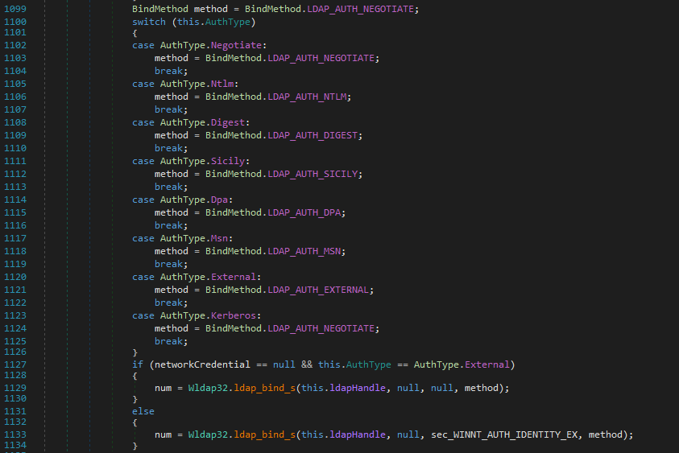
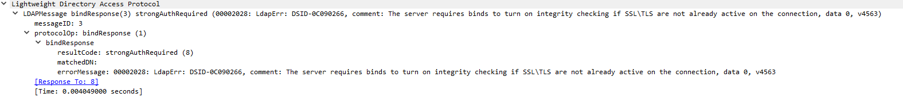
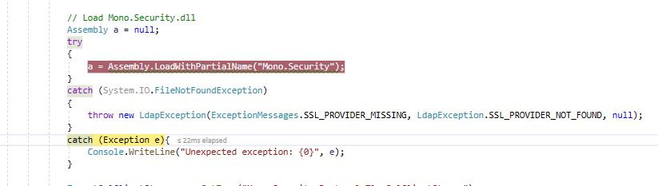
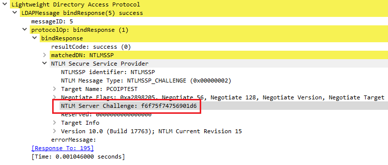

# When re-inventing the wheel is the easiest way

Recently, [@zyn3rgy][9] released [LdapRelayScan][8], a tool to check for LDAP protections regarding the relay of NTLM 
authentication. The tool can tell you whether an LDAP server enforces certain kind of protections, like
SSL or Channel Binding, and is extremely helpful to identify cases when you can relay NTLM over LDAP using
tools like `ntlmrelayx.py`. 

Talking with [S3cur3Th1sSh1t][10], I realised it could have been helpful to have a PowerShell or C#
tool to check for this misconfiguration, instead of just the Python version.

He warned me that the task could be not easy, because they were noticing different results using the library offered 
by Windows itself `System.DirectoryServices` in comparison with the Python library. 

I've started looking to it a bit after we talked about it, as this picked up my interest. In the rest of this
post, I'll describe more what I did, failed attempts included, to come up with solution to the problem.

The final tool can be found [SharpLdapRelayScan](https://github.com/klezVirus/SharpLdapRelayScan).

## Reversing the Directory Service DLL

Reversing .NET binaries is something made extremely easy by tools like [dnSpy][1]. Using this tool, it's possible 
to decompile C# binaries back into something which is really near to the original source code.

In this case, we were interested in understanding how the `System.DirectoryServices` class was handling user 
authentication. Mostly, we wondered: can we reproduce or raise the errors as shown in [impacket][2]?

By reversing `System.DirectoryServices` in [dnSpy][1], it was easy to observe how this managed DLL is merely a wrapper
around the unmanaged DLL `wldap32.dll`. The methods we are interested in are the one called within the Ldap Bind
process.


The `Bind` process merely calls a helper function, which in turn just populates a `SEC_WINNT_AUTH_IDENTITY_EX`
structure and calls `wldap32::ldap_bind_s`.



## SSL Enforced Testing: Done!

This kind of implementation was pretty easy to reproduce in a standalone binary, as observable
below:

```cs
public int Bind(LdapConnection connection, SEC_WINNT_AUTH_IDENTITY_EX identity)
{
    if (connection == null)
    {
        return -1;
    }

    int num;
    SafeHandleZeroOrMinusOneIsInvalid safeHandle = ReflectionHelper.GetPrivateFieldValue<SafeHandleZeroOrMinusOneIsInvalid>(connection, "ldapHandle");
    IntPtr rawHandle = ReflectionHelper.GetPrivateFieldValue<IntPtr>(safeHandle, "handle");
    ConnectionHandle ldapHandle = new ConnectionHandle(rawHandle, true);

    if (ldapHandle == null)
    {
        Console.WriteLine("[-] Failed to get connection handle");
        return -1;
    }

    num = Wldap32.ldap_bind_s(ldapHandle, null, identity, BindMethod.LDAP_AUTH_SICILY);
    return num;
}
```

As observable, we needed to enforce the `Sicily` method for authentication, as for the original 
[POC](https://github.com/zyn3rgy/LdapRelayScan/blob/main/LdapRelayScan.py). If the error code coming back from `ldap_bind_s` is 8, we can easily assume that SSL Enforcing is in
place. 



## Testing EnforceChannelBinding

If the previous part appeared too easy, don't worry, the annoying part is coming. 

According to the original POC, testing channel binding is a bit trickier. Indeed, when we try to 
connect to an LDAP server using [Sicily Authentication][11] and NTLM credentials, connecting from a
client which doesn't support Channel Binding, we receive an extended message from the server saying our 
client didn't provide the correct Channel Binding Information. However, the error code returned by
`ldap_bind_s` would be always 49 (Incorrect Credentials).

We need a way to grasp the extended error message from the server. After a bit of documentation reading,
I discovered this could be easily achieved using the exposed API `ldap_get_option`, by passing it the option
`LDAP_OPT_SERVER_ERROR`, which gives us exactly what we needed.

However, triggering the error in the first place was everything except trivial.

### Understanding the problem

The main problem I've encountered in my tests was that regardless the authentication combination I was 
trying to use (GSS-SPNEGO, GSSAPI, etc.), the channel binding token was always added to the NTLM response.

The reason was also easy to understand: there is nothing in the code that was allowing us to control the 
authentication flow. Everything is well hidden inside `ldap_bind_s`.

Once I detected the issue, I needed to plan some ways to solve it, and I imagined 3 potential solution:

* Find a way to get the Channel Binding Information and zero it out
* Build the LDAP messages manually (using existing APIs or re-implementing the authentication flow)

There are a few methods exposed by the `wldap32.dll` library which are actively involved with the binding 
process, and are the following:

* `ldap_bindA`, `ldap_bindW`
* `ldap_bind_sA`, `ldap_bind_sW`
* `ldap_simple_bindA`, `ldap_simple_bindW`
* `ldap_simple_bind_sA`, `ldap_simple_bind_sW`
* `ldap_sasl_bindA`, `ldap_sasl_bindW`
* `ldap_sasl_bind_sA`, `ldap_sasl_bind_sW`

All these methods have been configured to support different authentication protocols, ranging 
from simple username and password, to more complex protocols such as NTLM or Kerberos, which
are provided via SSPI (Secure Support Provider Interface).

No need to say I've tried using different functions in different ways, without any success. I went as far as reversing 
`wldap32.dll`, to check if there was anything useful for my needs, but nothing came out. 

What I've seen is that the Windows Ldap API `ldap_bind_s` calls internal (private) 
methods to set up the LdapMessage structure, and even managing to find the structure in memory would 
require some effort to modify and use them.

### Nullify the CBT?

So, I decided to check if there was any way to access the Channel Binding information from an
existing SChannel connection, to nullify or tamper it in a suitable way.

Checking on the documentation, I've noticed a potentially interesting LDAP option: `LDAP_OPT_SECURITY_CONTEXT`.

Following the documentation, it is possible to obtain the existing Security Context as a pointer to a `Ctxhandle` 
structure. This, in turn should allow us to get the Channel Binding Information, by using the 
[QueryContextAttributes][12] API.

```cs
public enum ContextAttributes : uint
{
    SECPKG_ATTR_ENDPOINT_BINDINGS = 0x0000001A,
    SECPKG_ATTR_UNIQUE_BINDINGS = 0x00000019
}

[DllImport("secur32.dll", CharSet = CharSet.Auto, SetLastError = false)]
public static extern SecError QueryContextAttributes(
    ref SecHandle phContext,
    ContextAttributes ulAttribute,
    out IntPtr pContextAttributes
    );

...

QueryContextAttributes(ref ctxHandle, ContextAttributes.SECPKG_ATTR_ENDPOINT_BINDINGS, out data);
```

If we could get the handle to Security Context, we might be able to change the Channel Binding information using
a call to `SetContextAttributes` API.

```c
SECURITY_STATUS SEC_ENTRY SetContextAttributesW(
  [in] PCtxtHandle   phContext,
  [in] unsigned long ulAttribute,
  [in] void          *pBuffer,
  [in] unsigned long cbBuffer
);
```

Apparently, this was a very promising idea. However, I've never managed to get a handle to the
Security Context. The `QueryContextAttributes` always returned `SEC_E_UNSUPPORTED_FUNCTION`.

> **Note:** If anyone knows a way to do it, or know why this is failing, please get in touch!

#### Using SASL authentication

However, if we uses `ldap_sasl_bind_s`, it could be possible to trigger the same bug using the SASL 
authentication method. I tried to go down this road, but I failed for some reason.

A few hours before I published this, [cube0x0](https://twitter.com/cube0x0) released a C# + BOF of this
technique. Instead of trying to let `System.DirectoryService` initialise the security context, and try
to modify it later, he creates a new context using `InitializeSecurityContext` and then uses `ldap_sasl_bind`.

You can find the project [HERE](https://github.com/cube0x0/LdapSignCheck). Clean, easy to read, amazing. 
I'm still astonished seeing how fast he is coming up with C/C# solutions.

## Reinventing the wheel

While I was searching for viable options, I found the Novell CSharp LDAP library. The Library already 
implemented the basics messaging protocol that I needed, so I said to myself it would have been good as a starting point.

The Novell C# library can be downloaded [here][13].

However, as soon as I started using it, I noticed it didn't even compile, raising an exception about 
a missing dependency. This is not because there is a problem with the library itself, but because it was designed
to be compiled with [Mono](https://www.mono-project.com/).

## Debugging Novell LDAP Library

We could easily observe the exception was originating in this piece of code:



### Fixing the SSL Stream Exception

Microsoft offers an implementation of `SslStream` which superseded the now deprecated `SslClientStream` class.
The `SslStream` class implements a general TLS wrapper around a socket connection, and it's perfectly suitable for our use 
case.

The final code looks like this:
```cs
var clientConnection = new TcpClient(AddressFamily.InterNetwork);
clientConnection.Connect(this.host, this.port);

SslStream sslstream = new SslStream(
    clientConnection.GetStream(),
    true,
    AllowAnyServerCertificate);

sslstream.AuthenticateAsClient(this.host);

in_Renamed = (System.IO.Stream)sslstream;
out_Renamed = (System.IO.Stream)sslstream;
```

### Adding support for SSPI

By default, the Novell library supports only Simple password authentication over TLS. As we previously 
discussed, to trigger the error we're looking for, we need to attempt the authentication using SSPI(NTLM),
and omit the Channel Binding Token information, meaning we have to implement everything ourselves.

As observable, the Novell library didn't offer many of the structures needed to do this, but having already
the underlying connection mechanism setup, it was still useful as a starting point.

We need to implement:

* Missing ASN1 Structures
* NTLM TOKEN Acquisition Mechanism
* NTLM LdapBindRequest for SSPI(NTLM)
* NTLM LdapBindResponse Parser for SSPI(NTLM)

First, we need to add the structures to support the Sicily protocol. Sicily is a protocol developed by Microsoft
to embed NTLM into LDAP requests/responses, and as such, is not really standardised in any RFC (at least, 
I couldn't find any RFC describing it). While I was doing a bit of research about it, I stumbled across [SkelSec][3] 
[msldap][4] implementation, and it was funny to see that also some other researcher had some "fun" with this protocol:


Now, the Sicily authentication protocol has merely 3 important ASN.1 objects, `SicilyPackageDiscover`, `SicilyNegotiate`, 
and `SicilyResponse`. 

The first one, `SicilyPackageDiscover`, is merely and empty LdapRequest. The aim of this request is
to understand whether the server supports NTLM authentication.


If the server does support NTLM authentication, it will answer with an LDAP response containing 
the `matchedDN` ANS.1 object set to "NTLM".


#### The NTLM Negotiate Message

At this point things got a bit more "interesting" (or extremely annoying, as you wish). 

The NTLM [NEGOTIATE_MESSAGE][5] is the second step of the authentication process. In this message,
the client and the server "Negotiate" the "configuration" of the authentication. This is done by the client
using special Flags. 


If everything goes well, the server will respond with a [challenge message][6], containing a CHALLENGE,
in the form of a byte array. This challenge will be used by the client as a signing key for the final step.



#### The NTLM Authentication Message

Finally, the client uses the information from the previous challenge to build an NTLM 
[authenticate message][7]. The most important part of an `AUTHENTICATE_MESSAGE` is the 
NTLM response. The response is based on the server challenge, which is used to sign the
entire data in the NTLMv2 Response. The implementation is something like this:

```cs
private byte[] __generateNtProof(byte[] serverChallenge, byte[] NtlmV2Hash) {
    IEnumerable<byte> bytes = new byte[] { };
    // Server Challenge
    bytes = bytes.Concat(serverChallenge);
    // Response Type
    bytes = bytes.Concat(this.responseType);
    // Hi Response Type
    bytes = bytes.Concat(this.hiResponseType);
    // Reserved1
    bytes = bytes.Concat(this.reserved1);
    // Timestamp
    bytes = bytes.Concat(this.timestamp);
    // Client Challenge
    bytes = bytes.Concat(this.challengeFromClient);
    // Reserved2
    bytes = bytes.Concat(BitConverter.GetBytes(this.reserved2));
    // Details (AVPairs)
    bytes = bytes.Concat(this.details.ToBytes());
    // Reserved3
    bytes = bytes.Concat(BitConverter.GetBytes(this.reserved3));

    // Debugging
    var md5 = new HMACMD5(NtlmV2Hash);
    byte[] temp = bytes.ToArray();
    byte[] result = md5.ComputeHash(temp);
#if DEBUG
    Console.WriteLine("[DEBUG] NTProof - " + BitConverter.ToString(result));
#endif
    return result;
}
```


As we didn't include information on the CBT, if the server enforces channel binding, the message 
will be rejected once received, with the extended server error labeled `80090346`, as from the
original POC.


## Credits

Thanks [S3cur3Th1sSh1t][10] for giving me the drive to do this. Thanks to [zyn3rgy][9] for [LdapRelayScan][8]. 
And thanks to [SkelSec][3] for implementing [msldap][4], such a wonderful library! 

## References

* [LdapRelayScan][8] by [zyn3rgy][9]
* [MSLDAP][4] by [SkelSec][3]
* [Microsoft MS-NLMP][14]

[Back](..)

[Back to Home](https://klezvirus.github.io/)

[1]: https://github.com/dnSpy/dnSpy
[2]: https://github.com/SecureAuthCorp/impacket
[3]: https://twitter.com/SkelSec
[4]: https://github.com/skelsec/msldap
[5]: https://docs.microsoft.com/en-us/openspecs/windows_protocols/ms-nlmp/b34032e5-3aae-4bc6-84c3-c6d80eadf7f2
[6]: https://docs.microsoft.com/en-us/openspecs/windows_protocols/ms-nlmp/801a4681-8809-4be9-ab0d-61dcfe762786
[7]: https://docs.microsoft.com/en-us/openspecs/windows_protocols/ms-nlmp/033d32cc-88f9-4483-9bf2-b273055038ce
[8]: https://github.com/zyn3rgy/LdapRelayScan
[9]: https://twitter.com/zyn3rgy
[10]: https://twitter.com/shitsecure
[11]: https://docs.microsoft.com/en-us/openspecs/windows_protocols/ms-adts/8b9dbfb2-5b6a-497a-a533-7e709cb9a982
[12]: https://docs.microsoft.com/en-us/windows/win32/secauthn/querycontextattributes--schannel#:~:text=The%20QueryContextAttributes%20(Schannel)%20function%20enables,attributes%20of%20a%20security%20context.
[13]: https://www.microfocus.com/documentation/edirectory-developer-documentation/ldap-libraries-for-c-sharp/CsharpLDAP-v2.1.11-files.zip
[14]: https://docs.microsoft.com/en-us/openspecs/windows_protocols/ms-nlmp/b38c36ed-2804-4868-a9ff-8dd3182128e4